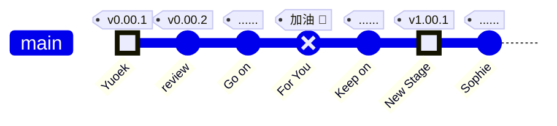

# Yuoek Docs

     

{}
**為虞十载，我心万宁** For you
{}

{}

1.     
    

    🏷① 完成了基本目录构成，下面就开始学习、收集资料吧！

2.     
    

    🏷① 添加 3700 道 Leetcode 题目;     
    🏷② 用 AI 重新组织知识库：目录 → markmap, revealjs。    

{}

