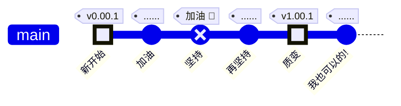

# Yuoek Docs

     
算法
{}
**"视代码如诗词，勿要做无所谓的堆砌。"——伊利亚·多尔曼 (Ilya Dorman)** 
{}

{}
**"生活不是等待风暴过去，而是学会在雨中跳舞。"——纪伯伦 (Khalil Gibran)** 开始学习吧！🚩
{}

```mermaid 
gitGraph
   commit id: "新开始" type: HIGHLIGHT tag: "v0.00.1"
   commit id: "加油" tag: "......"
   commit id: "坚持" type: REVERSE tag: "加油 🙂"
   commit id: "再坚持" tag: "......"
   commit id: "质变" type: HIGHLIGHT tag: "v1.00.1"
   commit id: "我也可以的!" tag: "......"

```

{}

1.     
    

    🏷

{}

