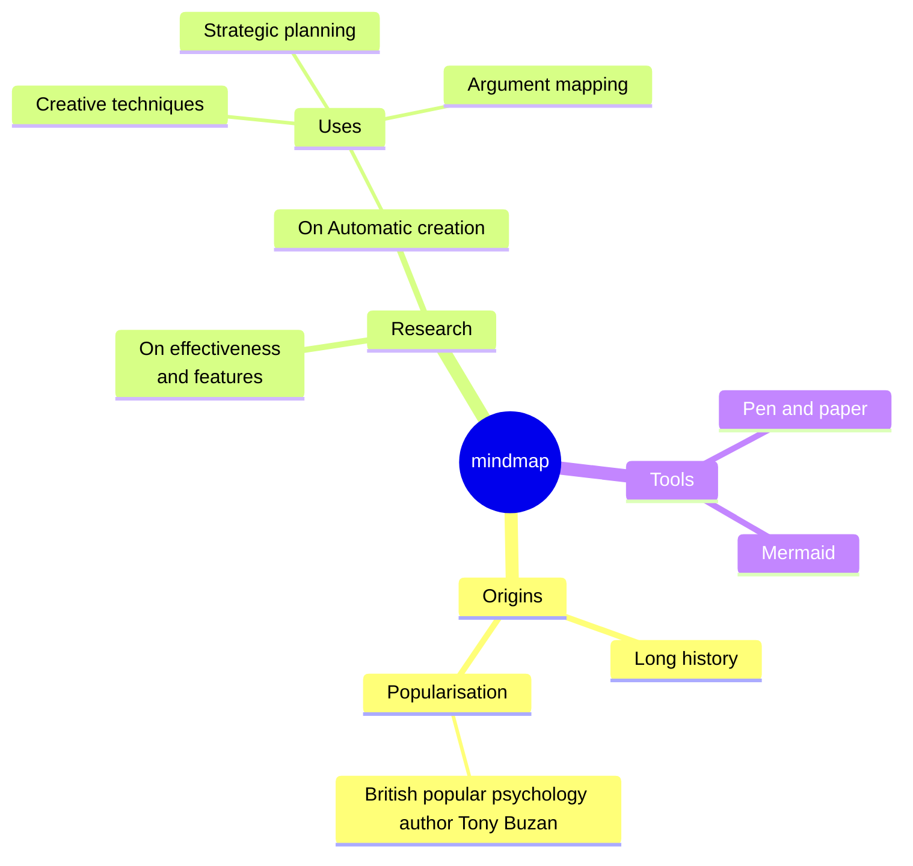
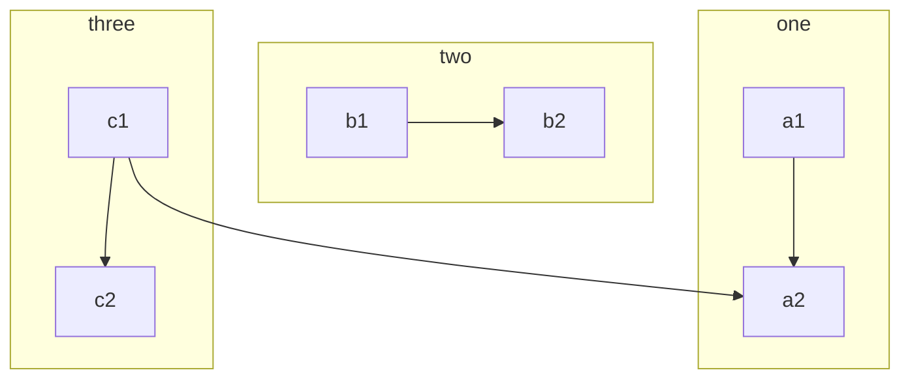
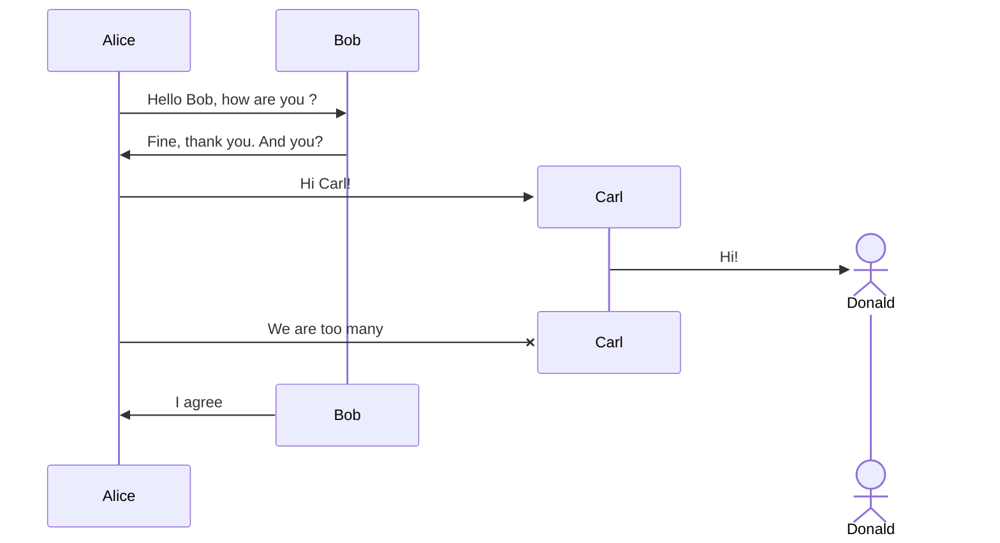
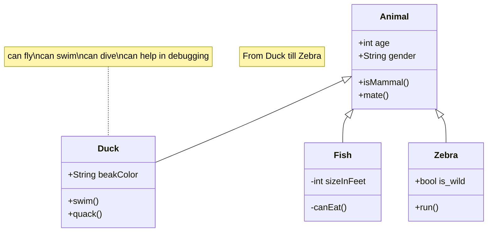



## 外延 shortcode

### revealjs 幻灯片 


{}
````markdown


## 😎 这是网页幻灯片
## Revealjs 
--- 
| Y & R | Dialogue |
| -------------- | --------------- |
| **Yuoek:** | 你有什么功能呢？🤔 |
| **Revealjs:** | 我能插入图片。📸 |

___
**Revealjs:** 看！我插入的照片如下
<p align="center">

<center style="font-size:12px;color:#c9c9c9;text-decoration:underline"> Flying </center>
</p>

---

| Y & R | Dialogue |
| -------------- | --------------- |
| **Yuoek:** | Cool! 还有吗？🤔 |
| **Revealjs:** | 当然有！我还能渲染 latex 公式。😎 |

___

**Revealjs:** 看！我渲染的 $\LaTeX$ 公式如下

♥️  $128\sqrt{e980}$ 

💖  $ r = a(1-sin\theta)$

___ 
| Y & R | Dialogue |
| -------------- | --------------- |
|**Revealjs:** | 上面只是爱而不得, 下面来演示傅里叶变换 |
$$
\mathcal{F}\{f(t)\} = F(\omega) = \int_{-\infty}^{\infty} f(t) e^{-i \omega t} \, dt
$$

$$
\mathcal{F}^{-1}\{F(\omega)\} = f(t) = \frac{1}{2\pi} \int_{-\infty}^{\infty} F(\omega) e^{i \omega t} \, d\omega
$$

___
| Y & R | Dialogue |
| -------------- | --------------- |
|**Revealjs:** | 光的本质, 下面来看看麦克斯韦方程组吧!✨ |
$$
\nabla \cdot \mathbf{E} = \frac{\rho}{\epsilon_0}
$$
$$
\nabla \cdot \mathbf{B} = 0
$$
$$
\nabla \times \mathbf{E} = -\frac{\partial \mathbf{B}}{\partial t}
$$
$$
\nabla \times \mathbf{B} = \mu_0 \mathbf{J} + \mu_0 \epsilon_0 \frac{\partial \mathbf{E}}{\partial t}
$$
___ 

| Y & R | Dialogue |
| -------------- | --------------- |
|**Revealjs:** | 数学，宇宙通用的语言，我们再来看看上帝公式吧！|

$e^{i\pi} + 1 = 0$

---

| Y & R | Dialogue |
| -------------- | --------------- |
| **Yuoek:** | Woooh 🥳 太棒啦! 最后还有吗？🤔 |
| **Revealjs:** | 有啊！我还能写代码块呢。💻😎 |

___

| Y & R | Dialogue |
| -------------- | --------------- |
|**Revealjs:** | 计算机与世界的对话 Hello, World! |
### Python 
```python 
def Yu():
    print("Hello, World")
    print("Hi, Yuoek")

Yu()

```
___ 

### C
```c 
#include <stdio.h> 
int main(){
    printf("Hello, World!\n");
    printf("Hi, Yuoek!\n");
    
    return 0;
}
```
___ 

### Cpp
```cpp 
#include <iostream> 
using namespace std;
int main(){
    cout << "Hello, World!" << endl;
    cout << "Hi~, Yuoek!" << endl;
    
    return 0;
}
```
___ 

### Java
```java
public class HelloWorld {
    public static void main(String[] args) {
        System.out.println("Hello, world!");
        System.out.println("Hi~~Yuoek");
    }
}
```
___ 



````
{}




## 😎 这是网页幻灯片
## Revealjs 
--- 
| Y & R | Dialogue |
| -------------- | --------------- |
| **Yuoek:** | 你有什么功能呢？🤔 |
| **Revealjs:** | 我能插入图片。📸 |

___
**Revealjs:** 看！我插入的照片如下
<p align="center">

<center style="font-size:12px;color:#c9c9c9;text-decoration:underline"> Flying </center>
</p>

---

| Y & R | Dialogue |
| -------------- | --------------- |
| **Yuoek:** | Cool! 还有吗？🤔 |
| **Revealjs:** | 当然有！我还能渲染 latex 公式。😎 |

___

**Revealjs:** 看！我渲染的 $\LaTeX$ 公式如下

♥️  $128\sqrt{e980}$ 

💖  $ r = a(1-sin\theta)$

___ 
| Y & R | Dialogue |
| -------------- | --------------- |
|**Revealjs:** | 上面只是爱而不得, 下面来演示傅里叶变换 |
$$
\mathcal{F}\{f(t)\} = F(\omega) = \int_{-\infty}^{\infty} f(t) e^{-i \omega t} \, dt
$$

$$
\mathcal{F}^{-1}\{F(\omega)\} = f(t) = \frac{1}{2\pi} \int_{-\infty}^{\infty} F(\omega) e^{i \omega t} \, d\omega
$$

___
| Y & R | Dialogue |
| -------------- | --------------- |
|**Revealjs:** | 光的本质, 下面来看看麦克斯韦方程组吧!✨ |
$$
\nabla \cdot \mathbf{E} = \frac{\rho}{\epsilon_0}
$$
$$
\nabla \cdot \mathbf{B} = 0
$$
$$
\nabla \times \mathbf{E} = -\frac{\partial \mathbf{B}}{\partial t}
$$
$$
\nabla \times \mathbf{B} = \mu_0 \mathbf{J} + \mu_0 \epsilon_0 \frac{\partial \mathbf{E}}{\partial t}
$$
___ 

| Y & R | Dialogue |
| -------------- | --------------- |
|**Revealjs:** | 数学，宇宙通用的语言，我们再来看看上帝公式吧！|

$e^{i\pi} + 1 = 0$

---

| Y & R | Dialogue |
| -------------- | --------------- |
| **Yuoek:** | Woooh 🥳 太棒啦! 最后还有吗？🤔 |
| **Revealjs:** | 有啊！我还能写代码块呢。💻😎 |

___

| Y & R | Dialogue |
| -------------- | --------------- |
|**Revealjs:** | 计算机与世界的对话 Hello, World! |
### Python 
```python 
def Yu():
    print("Hello, World")
    print("Hi, Yuoek")

Yu()

```
___ 

### C
```c 
#include <stdio.h> 
int main(){
    printf("Hello, World!\n");
    printf("Hi, Yuoek!\n");
    
    return 0;
}
```
___ 

### Cpp
```cpp 
#include <iostream> 
using namespace std;
int main(){
    cout << "Hello, World!" << endl;
    cout << "Hi~, Yuoek!" << endl;
    
    return 0;
}
```
___ 

### Java
```java
public class HelloWorld {
    public static void main(String[] args) {
        System.out.println("Hello, world!");
        System.out.println("Hi~~Yuoek");
    }
}
```
___ 



### tikz 画图

#### 笑脸 smile 


{}

```latex

\begin{tikzpicture}
  \draw[shading=ball, ball color=yellow] (0,0) circle [radius=2];
  \draw[shading=ball, ball color=black] (-0.5,0.5,0) ellipse [x radius=0.2, y radius=0.4];
  \draw[shading=ball, ball color=black] (0.5,0.5,0) ellipse [x radius=0.2, y radius=0.4];
  \draw[very thick] (-1,-1) arc [start angle=185, end angle=355,
    x radius=1, y radius=0.5];
\end{tikzpicture}


```

{}


\begin{tikzpicture}
  \draw[shading=ball, ball color=yellow] (0,0) circle [radius=2];
  \draw[shading=ball, ball color=black] (-0.5,0.5,0) ellipse [x radius=0.2, y radius=0.4];
  \draw[shading=ball, ball color=black] (0.5,0.5,0) ellipse [x radius=0.2, y radius=0.4];
  \draw[very thick] (-1,-1) arc [start angle=185, end angle=355,
    x radius=1, y radius=0.5];
\end{tikzpicture}



#### 电路图 circuit 


{}
```latex

\usetikzlibrary {circuits.logic.US}
\usetikzlibrary {matrix}
\begin{tikzpicture}[circuit logic US]

  \draw[help lines] (-5,-5) grid (5,5);

   \node (i0) at (0,2)  {Digit0};
   \node (i1)  at (0,0) {DigitCicu1};
   \node (i2)  at (0,-2) {1};
  \node [and gate] at (2,1) (a1) {$a1$};
  \node [xor gate] at (2,-1) (a2) {$a2$};
  \node [nand gate, fill=yellow] at (4,0) (o) {$o$};
  \draw (i0.east) -- (1,2) |- (a1.input 1);
  \draw (i1.east) -- (1,0) |- (a1.input 2);
  \draw (i1.east) -- (1,0) |- (a2.input 1);
  \draw (i2.east) -- (1,-2) |- (a2.input 2);
  \draw (a1.output) -- (3,1) |- (o.input 1);
  \draw (a2.output) -- (3,-1) |- (o.input 2);
  \draw (o.output) -- ++(right:5mm);
\end{tikzpicture}

```

{}


\usetikzlibrary {circuits.logic.US}
\usetikzlibrary {matrix}
\begin{tikzpicture}[circuit logic US]

  \draw[help lines] (-5,-5) grid (5,5);

   \node (i0) at (0,2)  {Digit0};
   \node (i1)  at (0,0) {DigitCicu1};
   \node (i2)  at (0,-2) {1};
  \node [and gate] at (2,1) (a1) {$a1$};
  \node [xor gate] at (2,-1) (a2) {$a2$};
  \node [nand gate, fill=yellow] at (4,0) (o) {$o$};
  \draw (i0.east) -- (1,2) |- (a1.input 1);
  \draw (i1.east) -- (1,0) |- (a1.input 2);
  \draw (i1.east) -- (1,0) |- (a2.input 1);
  \draw (i2.east) -- (1,-2) |- (a2.input 2);
  \draw (a1.output) -- (3,1) |- (o.input 1);
  \draw (a2.output) -- (3,-1) |- (o.input 2);
  \draw (o.output) -- ++(right:5mm);
\end{tikzpicture}



#### 函数图像 


{}
```latex


\begin{tikzpicture}[scale=2,x=1mm,y=1mm]
  \draw[help lines, step=2mm] (-30,-30) grid (30,30)
       [step=0.25mm]      (1,2) grid +(1,1);

  \draw[->] (-30,0) -- (30,0) node[right] {$x$};
  \draw[->] (0,-30) -- (0,30) node[above] {$f(x)$};

  \draw[smooth, samples=100] (-.5,20) parabola bend (0,0) (10,20) node[below right] {$x^2$};
  \draw[green,  smooth, domain=0.1:20, samples=200] plot (\x, {ln(\x)}) node[right] {$\ln(x)$};
  \draw[thin, violet, domain=-4*pi:6*pi, samples=300] plot (\x, {sin(\x r)}) node[above right] {$y=\sin(x)$};
  \draw[thin, orange, domain=-pi:-pi/2-0.1, samples=100] plot (\x, {tan(\x r)});
  \draw[thin, orange, domain=-pi/2+0.1:pi/2-0.1, samples=100] plot (\x, {tan(\x r)});
  \draw[thin, orange, domain=pi/2+0.1:pi, samples=100] plot (\x, {tan(\x r)}) node[above right] {$y=\tan(x)$};
  \draw[thin, red, domain=-3:3, samples=100] plot (\x, {\x*\x*\x}) node[right] {$y=x^3$};
  \draw[thin, blue, domain=-23:-18, samples=100] plot (\x, {1/(sqrt(2*pi))*exp(-(-20-\x)^2/2)}) node[below] {$y=\frac{1}{\sqrt{2\pi}}e^{-\frac{x^2}{2}}$};
\end{tikzpicture}


```

{}


\begin{tikzpicture}[scale=2,x=1mm,y=1mm]
  \draw[help lines, step=2mm] (-30,-30) grid (30,30)
       [step=0.25mm]      (1,2) grid +(1,1);

  \draw[->] (-30,0) -- (30,0) node[right] {$x$};
  \draw[->] (0,-30) -- (0,30) node[above] {$f(x)$};

  \draw[smooth, samples=100] (-.5,20) parabola bend (0,0) (10,20) node[below right] {$x^2$};
  \draw[green,  smooth, domain=0.1:20, samples=200] plot (\x, {ln(\x)}) node[right] {$\ln(x)$};
  \draw[thin, violet, domain=-4*pi:6*pi, samples=300] plot (\x, {sin(\x r)}) node[above right] {$y=\sin(x)$};
  \draw[thin, orange, domain=-pi:-pi/2-0.1, samples=100] plot (\x, {tan(\x r)});
  \draw[thin, orange, domain=-pi/2+0.1:pi/2-0.1, samples=100] plot (\x, {tan(\x r)});
  \draw[thin, orange, domain=pi/2+0.1:pi, samples=100] plot (\x, {tan(\x r)}) node[above right] {$y=\tan(x)$};
  \draw[thin, red, domain=-3:3, samples=100] plot (\x, {\x*\x*\x}) node[right] {$y=x^3$};
  \draw[thin, blue, domain=-23:-18, samples=100] plot (\x, {1/(sqrt(2*pi))*exp(-(-20-\x)^2/2)}) node[below] {$y=\frac{1}{\sqrt{2\pi}}e^{-\frac{x^2}{2}}$};
\end{tikzpicture}



### mermaid 画图


{}
````markdown

````

{}

#### 思维导图 mindmap 


#### 流程图 flowchart 


{}
````markdown

````

{}


#### 序列图 sequence 


{}
````markdown

````

{}


#### 类图 class 


{}
````markdown

````

{}


### markmap 思维导图


{}
```markdown


## 外延 shortcode

### revealjs 幻灯片 

### markmap 思维导图

### gsap 动画

### pythontutor 代码演示 

### media-card 书影音卡片 

###  subtitle 字幕播放

###  katex 公式渲染


## 内置 shortcode

### badges

### buttons

### cards

### columns

### details 

### hints

### katex

### steps 

### tabs 




```

{}




## 外延 shortcode

### revealjs 幻灯片 

### markmap 思维导图

### gsap 动画

### pythontutor 代码演示 

### media-card 书影音卡片 

###  subtitle 字幕播放

###  katex 公式渲染


## 内置 shortcode

### badges

### buttons

### cards

### columns

### details 

### hints

### katex

### steps 

### tabs 




### gsap 动画


{}
```markdown
##### 引用 cdn

<script src="https://cdn.jsdelivr.net/npm/gsap@3.13.0/dist/gsap.min.js"></script>


###### 创建 svg 

<svg viewBox='0 0 1200 600' style='background: white'>
<rect id='r1' x='50' y='100' width='100' height='100' fill='blue'/>
<rect id='r2' x='350' y='100' width='100' height='100'/>
</svg>


##### 引用 gsap

<script>

gsap.set('#r1', {transformOrigin:'center'});
gsap.set('#r2', {transformOrigin:'center'});

// 修正语法错误和标点符号
var t1 = gsap.timeline();
t1.to('#r1',{
    x:100, 
    y:100, 
    scaleX:2,
    fill:'red',
    stroke:'white',
    rotation:360,
    strokeWidth:5, // 修正拼写
    duration:5,
}).from('#r2',{
    x:100,
    y:100,
    scaleX:2, 
    fill:'red', 
    stroke: 'white',
    rotation:360, 
    strokeWidth:5, // 修正拼写
    duration:2,
}, '>-1');

</script>

```

{}


##### 引用 cdn


<script src="https://cdn.jsdelivr.net/npm/gsap@3.13.0/dist/gsap.min.js"></script>

```js
<script src="https://cdn.jsdelivr.net/npm/gsap@3.13.0/dist/gsap.min.js"></script>

```

###### 创建 svg 

<svg viewBox='0 0 1200 600' style='background: white'>
<rect id='r1' x='50' y='100' width='100' height='100' fill='blue'/>
<rect id='r2' x='350' y='100' width='100' height='100'/>
</svg>

```css
<svg viewBox='0 0 1200 600' style='background: white'>
<rect id='r1' x='50' y='100' width='100' height='100' fill='blue'/>
<rect id='r2' x='350' y='100' width='100' height='100'/>
</svg>

```

##### 引用 gsap

<script>

gsap.set('#r1', {transformOrigin:'center'});
gsap.set('#r2', {transformOrigin:'center'});

// 修正语法错误和标点符号
var t1 = gsap.timeline();
t1.to('#r1',{
    x:100, 
    y:100, 
    scaleX:2,
    fill:'red',
    stroke:'white',
    rotation:360,
    strokeWidth:5, // 修正拼写
    duration:5,
}).from('#r2',{
    x:100,
    y:100,
    scaleX:2, 
    fill:'red', 
    stroke: 'white',
    rotation:360, 
    strokeWidth:5, // 修正拼写
    duration:2,
}, '>-1');

</script>

```js
<script>

gsap.set('#r1', {transformOrigin:'center'});
gsap.set('#r2', {transformOrigin:'center'});

// 修正语法错误和标点符号
var t1 = gsap.timeline();
t1.to('#r1',{
    x:100, 
    y:100, 
    scaleX:2,
    fill:'red',
    stroke:'white',
    rotation:360,
    strokeWidth:5, // 修正拼写
    duration:5,
}).from('#r2',{
    x:100,
    y:100,
    scaleX:2, 
    fill:'red', 
    stroke: 'white',
    rotation:360, 
    strokeWidth:5, // 修正拼写
    duration:2,
}, '>-1');

</script>

```

### pythontutor 代码演示 


{}
```markdown

def decorator_function(original_function):
    def wrapper(*args, **kwargs):
        # 这里是在调用原始函数前添加的新功能
        before_call_code()
        
        result = original_function(*args, **kwargs)
        
        # 这里是在调用原始函数后添加的新功能
        after_call_code()
        
        return result
    return wrapper

# 使用装饰器
@decorator_function
def target_function(arg1, arg2):
    pass  # 原始函数的实现


```

{}

#### python 


def decorator_function(original_function):
    def wrapper(*args, **kwargs):
        # 这里是在调用原始函数前添加的新功能
        before_call_code()
        
        result = original_function(*args, **kwargs)
        
        # 这里是在调用原始函数后添加的新功能
        after_call_code()
        
        return result
    return wrapper

# 使用装饰器
@decorator_function
def target_function(arg1, arg2):
    pass  # 原始函数的实现



### media-card 书影音卡片 

{}
```markdown


{{/* %details "观后感 " */ %}}
我之所以...喜欢大海     
是因为它的宁静  
我说的不是..海浪    
而是别的东西    
神秘的东西  

是隐藏在深处    
明亮的大海  
大海是宁静的    
要学会倾听  
------《沉静如海》
{{/* %/details */ %}}



```

{}



{}
我之所以...喜欢大海     
是因为它的宁静  
我说的不是..海浪    
而是别的东西    
神秘的东西  

是隐藏在深处    
明亮的大海  
大海是宁静的    
要学会倾听  
------《沉静如海》
{}



###  subtitle 字幕播放


{}
```markdown


1263
00:00:53,100 --> 00:00:55,400
现在站在这的你  就是最完美的你
standing where you are right now, perfect.

1264
00:01:00,180 --> 00:01:03,710
然后我用充满男子气概的方式把你抱住
And I took you in my arms, in a manly kind of way.

1265
00:01:05,420 --> 00:01:06,580
像这样
Like this.

1266
00:01:07,720 --> 00:01:09,180
然后说
And said,

1267
00:01:12,720 --> 00:01:16,220
"罗茜  邓恩  你能带我去跳舞吗"
"Rosie Dunne, can I take you to the dance?"

1268
00:01:20,730 --> 00:01:29,260
迟来的总比没有好！
Better late than never.


```

{}


#### 《爱你·罗茜》



1263
00:00:53,100 --> 00:00:55,400
现在站在这的你  就是最完美的你
standing where you are right now, perfect.

1264
00:01:00,180 --> 00:01:03,710
然后我用充满男子气概的方式把你抱住
And I took you in my arms, in a manly kind of way.

1265
00:01:05,420 --> 00:01:06,580
像这样
Like this.

1266
00:01:07,720 --> 00:01:09,180
然后说
And said,

1267
00:01:12,720 --> 00:01:16,220
"罗茜  邓恩  你能带我去跳舞吗"
"Rosie Dunne, can I take you to the dance?"

1268
00:01:20,730 --> 00:01:29,260
迟来的总比没有好！
Better late than never.



###  katex 公式渲染


## 内置 shortcode


### badges

### buttons

### cards

### columns

### details 

### hints

### katex

### steps 

### tabs 

