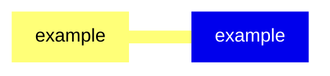
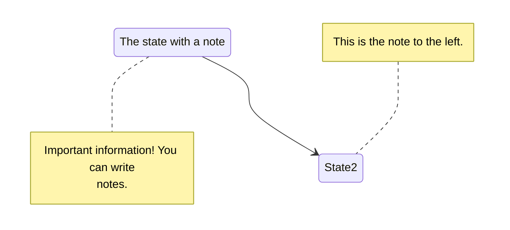




## tocShortcode


### 1 [animal](#1)
#### 1.1 [examle](#1)
### 2 [badges](#2)
#### 2.1 [example](#2)
### 3 [buttons](#3)
#### 3.1 [example](#3)
### 4 [cards](#4)
#### 4.1 [example](#4)
### 5 [columns](#5)
#### 5.1 [example](#5)
### 6 [details](#6)
#### 6.1 [example](#6)
### 7 [media-card](#7)
#### 7.1 [example](#7)
### 8 [example](#8)
#### 8.1 [example](#8)
### 9 [hints](#9)
#### 9.1 [example](#9)
### 10 [katex](#10)
#### 10.1 [example](#10)
### 11 [marmap](#11)
#### 11.1 [example](#11)
### 12 [mermaid](#12)
#### 12.1 [example](#12)
### 13 [pythontutor](#13)
#### 13.1 [example](#13)
### 14 [revealjs](#14)
#### 14.1 [example](#14)
### 15 [steps](#15)
#### 15.1 [example](#15)
### 16 [subtitle](#16)
#### 16.1 [example](#16)
### 17 [tabs](#17)
#### 17.1 [example](#17)
### 18 [tikz](#18)
#### 18.1 [example](#18)




### 1 animal

---
### 1 animal
___
#### 1.1 examle
### 2 badges

---
### 2 badges
___
#### 2.1 example
### 3 buttons

---
### 3 buttons
___
#### 3.1 example
### 4 cards

---
### 4 cards
___
#### 4.1 example
### 5 columns

---
### 5 columns
___
#### 5.1 example
### 6 details

---
### 6 details
___
#### 6.1 example
### 7 media-card

---
### 7 media-card
___
#### 7.1 example
### 8 example

---
### 8 example
___
#### 8.1 example
### 9 hints

---
### 9 hints
___
#### 9.1 example
### 10 katex

---
### 10 katex
___
#### 10.1 example
### 11 marmap

---
### 11 marmap
___
#### 11.1 example
### 12 mermaid

---
### 12 mermaid
___
#### 12.1 example
### 13 pythontutor

---
### 13 pythontutor
___
#### 13.1 example
### 14 revealjs

---
### 14 revealjs
___
#### 14.1 example
### 15 steps

---
### 15 steps
___
#### 15.1 example
### 16 subtitle

---
### 16 subtitle
___
#### 16.1 example
### 17 tabs

---
### 17 tabs
___
#### 17.1 example
### 18 tikz

---
### 18 tikz
___
#### 18.1 example



### 1 animal{#1}

{}


<--->
{}
{}
{}

<!--TODO-->

### 2 badges{#2}

{}
{}
````markdown
Badges can be used to annotate your pages with additional information or mark specific places in markdown content.

## Examples

| Shortcode | Output |
| --        | --     |
| ``     |      |
| `` |  |
| ``  |   |
| ``     |      |
| | |
| ``                    |                     |
| ``                    |                     |
| ``                               |                                |

## Use in links 

A badge can be wrapped in markdown link producing following result: [](https://github.com/gohugoio/hugo/releases/tag/v0.147.6)
```tpl
[](https://github.com/gohugoio/hugo/releases/tag/v0.147.6)
```
````
{}
<--->


{}
<!--TODO-->














### 3 buttons{#3}

{}


<--->
{}
````markdown
# Buttons

Buttons are styled links that can lead to local page or external link.

## Example

```tpl
Get Home
Contribute
```
````
{}
{}

<!--TODO-->



Get Home
Contribute




### 4 cards{#4}

{}
{}
```markdown
{}
- 
  **Markdown**  
  Suspendisse sed congue orci, eu congue metus. Nullam feugiat urna massa.
  

- 
  Suspendisse sed congue orci, eu congue metus. Nullam feugiat urna massa, et fringilla metus consectetur molestie.
  

- 
  ### Heading
  This is tab MacOS content.
  
{}

```
{}
<--->


{}

<!--TODO-->




{}
- 
  **Markdown**  
  Suspendisse sed congue orci, eu congue metus. Nullam feugiat urna massa.
  

- 
  Suspendisse sed congue orci, eu congue metus. Nullam feugiat urna massa, et fringilla metus consectetur molestie.
  

- 
  ### Heading
  This is tab MacOS content.
  
{}




### 5 columns{#5}

{}


<--->
{}
```markdown
{}
- ### Left Content
  Lorem markdownum insigne. Olympo signis Delphis! Retexi Nereius nova develat
  stringit, frustra Saturnius uteroque inter! Oculis non ritibus Telethusa
  protulit, sed sed aere valvis inhaesuro Pallas animam: qui _quid_, ignes.
  Miseratus fonte Ditis conubia.

- ### Mid Content
  Lorem markdownum insigne. Olympo signis Delphis! Retexi Nereius nova develat
  stringit, frustra Saturnius uteroque inter!

- ### Right Content
  Lorem markdownum insigne. Olympo signis Delphis! Retexi Nereius nova develat
  stringit, frustra Saturnius uteroque inter! Oculis non ritibus Telethusa
  protulit, sed sed aere valvis inhaesuro Pallas animam: qui _quid_, ignes.
  Miseratus fonte Ditis conubia.
{}


```
{}
{}

<!--TODO-->



{}
- ### Left Content
  Lorem markdownum insigne. Olympo signis Delphis! Retexi Nereius nova develat
  stringit, frustra Saturnius uteroque inter! Oculis non ritibus Telethusa
  protulit, sed sed aere valvis inhaesuro Pallas animam: qui _quid_, ignes.
  Miseratus fonte Ditis conubia.

- ### Mid Content
  Lorem markdownum insigne. Olympo signis Delphis! Retexi Nereius nova develat
  stringit, frustra Saturnius uteroque inter!

- ### Right Content
  Lorem markdownum insigne. Olympo signis Delphis! Retexi Nereius nova develat
  stringit, frustra Saturnius uteroque inter! Oculis non ritibus Telethusa
  protulit, sed sed aere valvis inhaesuro Pallas animam: qui _quid_, ignes.
  Miseratus fonte Ditis conubia.
{}



### 6 details{#6}

{}
{}

# Details

Details shortcode is a helper for `details` html5 element. It is going to replace `expand` shortcode.

## Example
```tpl
{}
## Markdown content
Lorem markdownum insigne...
{}
```
```tpl
{}
## Markdown content
Lorem markdownum insigne...
{}
```

{}
<--->


{}

<!--TODO-->



{}
## Markdown content
Lorem markdownum insigne...
{}




### 7 media-card{#7}

{}


<--->
{}
```markdown


{{/* %details "观后感 " */ %}}
我之所以...喜欢大海     
是因为它的宁静  
我说的不是..海浪    
而是别的东西    
神秘的东西  

是隐藏在深处    
明亮的大海  
大海是宁静的    
要学会倾听  
------《沉静如海》
{{/* %/details */ %}}


```
{}
{}

<!--TODO-->





{}
我之所以...喜欢大海     
是因为它的宁静  
我说的不是..海浪    
而是别的东西    
神秘的东西  

是隐藏在深处    
明亮的大海  
大海是宁静的    
要学会倾听  
------《沉静如海》
{}




### 8 example{#8}

{}
{}
{}
<--->


{}

### 9 hints{#9}

{}


<--->
{}
```markdown
{}
**Markdown content**  
Lorem markdownum insigne. Olympo signis Delphis! Retexi Nereius nova develat
stringit, frustra Saturnius uteroque inter! Oculis non ritibus Telethusa
{}

```
{}
{}

<!--TODO-->



{}
**Markdown content**  
Lorem markdownum insigne. Olympo signis Delphis! Retexi Nereius nova develat
stringit, frustra Saturnius uteroque inter! Oculis non ritibus Telethusa
{}




### 10 katex{#10}

{}
{}
```markdown

f(x) = \int_{-\infty}^\infty\hat f(\xi)\,e^{2 \pi i \xi x}\,d\xi


```
{}
<--->


{}

<!--TODO-->




f(x) = \int_{-\infty}^\infty\hat f(\xi)\,e^{2 \pi i \xi x}\,d\xi




### 11 marmap{#11}

{}


<--->
{}
```markdowm

## 国庆放假 

### 第一天
- 无事可做

### 第二天
- 无事可做

### 第三天
- 正在进行...

### 第四天
- [ ] 待办 (TODO)
- [x] 已完成 (DONE)

### 第五天
- [ ] TODO 

### 第六天
- [ ] TODO 

### 第七天
- [ ] TODO 

### 第八天
- [ ] TODO 


```
{}
{}

<!--TODO-->







### 12 mermaid{#12}

{}
{}
````markdown

````
{}
<--->


{}

<!--TODO-->

{}
{}

{}
{}
### 13 pythontutor{#13}

{}


<--->
{}
### java
```markdown

// Java代码
public class Main {
    public static void main(String[] args) {
        System.out.println("Hello World");
    }
}


```
### python 
```markdown

def decorator_function(original_function):
    def wrapper(*args, **kwargs):
        # 这里是在调用原始函数前添加的新功能
        before_call_code()
        
        result = original_function(*args, **kwargs)
        
        # 这里是在调用原始函数后添加的新功能
        after_call_code()
        
        return result
    return wrapper

# 使用装饰器
@decorator_function
def target_function(arg1, arg2):
    pass  # 原始函数的实现


```
###  c
```markdown

#include <stdio.h>
int main() {
    printf("Hello");
    int m = pow(10,2);
    printf("%d\n",m);
    return 0;
}


```
### cpp 
```markdown

#include <iostream>
using namespace std;
int main() {
    int x = 5;
    int y = 10;
    cout << "Sum: " << x + y << endl;
    return 0;
}



```
{}
{}

<!--TODO-->





{}

// Java代码
public class Main {
    public static void main(String[] args) {
        System.out.println("Hello World");
    }
}

{}
{}

def decorator_function(original_function):
    def wrapper(*args, **kwargs):
        # 这里是在调用原始函数前添加的新功能
        before_call_code()
        
        result = original_function(*args, **kwargs)
        
        # 这里是在调用原始函数后添加的新功能
        after_call_code()
        
        return result
    return wrapper

# 使用装饰器
@decorator_function
def target_function(arg1, arg2):
    pass  # 原始函数的实现


{}
{}

#include <stdio.h>
int main() {
    printf("Hello");
    int m = pow(10,2);
    printf("%d\n",m);
    return 0;
}


{}
{}

#include <iostream>
using namespace std;
int main() {
    int x = 5;
    int y = 10;
    cout << "Sum: " << x + y << endl;
    return 0;
}

{}




### 14 revealjs{#14}

{}
{}
````markdown



# Revealjs
## 嗨😄~ 这是网页幻灯片

---

<p align="center">

<center style="font-size:12px;color:#c9c9c9;text-decoration:underline"> logo  </center>
</p>

下面隐藏了你看不见的内容 👇


Note:
"迟来的不如永远不来，不是吗？"

---

### 插入图片

<p align="center">

<center style="font-size:12px;color:#c9c9c9;text-decoration:underline"> logo  </center>
</p>

{}


{}

---

### 插入表格

| Column1 | Column2 | Column3 |
| --------------- | --------------- | --------------- |
| Item1.1 | Item2.1 | Item3.1 |


---

### 插入代码

```cpp 
#include <iostream>
int main(){
    cout << "Hello, Yuoek" << endless
    return 0;
}

```

下面还有 👇

___


```js 
[1-2|3|4]
let a = 1;
let b = 2;
let c = x => 1 + 2 + x;
c(3);
```

--- 

### 插入 $\LaTeX$ 

\\(H_2O\\)

$$
x^2 = y^2
$$
___

$$
\int_{-\infty}^{\infty} e^{-x^2} dx = \sqrt{\pi}
$$



````
{}
<--->


{}

<!--TODO-->




<!--TODO-->




### 15 steps{#15}

{}


<--->
{}
# Steps

Steps shortcode styles numbered list as series of points for better content organization.

```tpl
{}
1. ## Suspendisse sed congue orci.
   ...

2. ## Maecenas scelerisque sem.
   ...

3. ## Etiam risus purus.
   ...

4. ## Curabitur sed lacinia velit.
   ...
{}
```

{}
{}

<!--TODO-->



{}
1. ## Suspendisse sed congue orci.
   Suspendisse sed congue orci, eu congue metus. Nullam feugiat urna massa, et fringilla metus consectetur molestie. Curabitur pellentesque sodales ipsum, sed efficitur libero euismod ac. Donec sit amet erat nunc. Suspendisse porta nisl velit, quis auctor massa commodo nec. Donec sollicitudin tellus sit amet massa condimentum luctus. Etiam molestie at ante et convallis.

2. ## Maecenas scelerisque sem.
   Maecenas scelerisque sem a tellus dignissim, in sodales neque varius. Integer quis ex quis sem posuere consequat. Morbi interdum ex et mollis maximus. Proin sed quam nisl. Donec tempus non risus vel auctor. Ut ultricies vitae urna in laoreet. Phasellus cursus nunc sit amet sodales euismod. Suspendisse potenti.

3. ## Etiam risus purus.
   Etiam risus purus, suscipit a orci quis, mollis mollis ante. Vestibulum congue nisl malesuada tortor egestas, a lobortis tellus dictum. Nam nec ultrices justo. Donec malesuada dignissim posuere. 

4. ## Curabitur sed lacinia velit.
   Curabitur sed lacinia velit. Nullam sed ante non quam lobortis hendrerit. Phasellus elementum, erat sit amet imperdiet pulvinar, odio massa lobortis ipsum, in tincidunt metus dolor vel ligula.

{}



### 16 subtitle{#16}

{}
{}

### 《爱你・罗茜》
```markdown


1263
00:00:53,100 --> 00:00:55,400
现在站在这的你  就是最完美的你
standing where you are right now, perfect.

1264
00:01:00,180 --> 00:01:03,710
然后我用充满男子气概的方式把你抱住
And I took you in my arms, in a manly kind of way.

1265
00:01:05,420 --> 00:01:06,580
像这样
Like this.

1266
00:01:07,720 --> 00:01:09,180
然后说
And said,

1267
00:01:12,720 --> 00:01:16,220
"罗茜  邓恩  你能带我去跳舞吗"
"Rosie Dunne, can I take you to the dance?"

1268
00:01:20,730 --> 00:01:29,260
迟来的总比没有好！
Better late than never.


```
{}
<--->


{}

<!--TODO-->







1263
00:00:53,100 --> 00:00:55,400
现在站在这的你  就是最完美的你
standing where you are right now, perfect.

1264
00:01:00,180 --> 00:01:03,710
然后我用充满男子气概的方式把你抱住
And I took you in my arms, in a manly kind of way.

1265
00:01:05,420 --> 00:01:06,580
像这样
Like this.

1266
00:01:07,720 --> 00:01:09,180
然后说
And said,

1267
00:01:12,720 --> 00:01:16,220
"罗茜  邓恩  你能带我去跳舞吗"
"Rosie Dunne, can I take you to the dance?"

1268
00:01:20,730 --> 00:01:29,260
迟来的总比没有好！
Better late than never.





### 17 tabs{#17}

{}


<--->
{}
### Tabs   
Tabs let you organize content by context, for example installation instructions for each supported platform.  
```markdown
  
{} # MacOS Content {}  
{} # Linux Content {}  
{} # Windows Content {}  
  
```
{}
{}

<!--TODO-->







{}
# MacOS  

This is tab **MacOS** content.

Lorem markdownum insigne. Olympo signis Delphis! Retexi Nereius nova develat
stringit, frustra Saturnius uteroque inter! Oculis non ritibus Telethusa
protulit, sed sed aere valvis inhaesuro Pallas animam: qui _quid_, ignes.
Miseratus fonte Ditis conubia.
{}

{}
# Linux

This is tab **Linux** content.

Lorem markdownum insigne. Olympo signis Delphis! Retexi Nereius nova develat
stringit, frustra Saturnius uteroque inter! Oculis non ritibus Telethusa
protulit, sed sed aere valvis inhaesuro Pallas animam: qui _quid_, ignes.
Miseratus fonte Ditis conubia.
{}

{}
# Windows

This is tab **Windows** content.

Lorem markdownum insigne. Olympo signis Delphis! Retexi Nereius nova develat
stringit, frustra Saturnius uteroque inter! Oculis non ritibus Telethusa
protulit, sed sed aere valvis inhaesuro Pallas animam: qui _quid_, ignes.
Miseratus fonte Ditis conubia.
{}






### 18 tikz{#18}

{}
{}
{}
<--->


{}

<!--TODO-->



\begin{tikzpicture}[scale=2,x=1mm,y=1mm]
  \draw[help lines, step=2mm] (-30,-30) grid (30,30)
       [step=0.25mm]      (1,2) grid +(1,1);

  \draw[->] (-30,0) -- (30,0) node[right] {$x$};
  \draw[->] (0,-30) -- (0,30) node[above] {$f(x)$};

  \draw[smooth, samples=100] (-.5,20) parabola bend (0,0) (10,20) node[below right] {$x^2$};
  \draw[green,  smooth, domain=0.1:20, samples=200] plot (\x, {ln(\x)}) node[right] {$\ln(x)$};
  \draw[thin, violet, domain=-4*pi:6*pi, samples=300] plot (\x, {sin(\x r)}) node[above right] {$y=\sin(x)$};
  \draw[thin, orange, domain=-pi:-pi/2-0.1, samples=100] plot (\x, {tan(\x r)});
  \draw[thin, orange, domain=-pi/2+0.1:pi/2-0.1, samples=100] plot (\x, {tan(\x r)});
  \draw[thin, orange, domain=pi/2+0.1:pi, samples=100] plot (\x, {tan(\x r)}) node[above right] {$y=\tan(x)$};
  \draw[thin, red, domain=-3:3, samples=100] plot (\x, {\x*\x*\x}) node[right] {$y=x^3$};
  \draw[thin, blue, domain=-23:-18, samples=100] plot (\x, {1/(sqrt(2*pi))*exp(-(-20-\x)^2/2)}) node[below] {$y=\frac{1}{\sqrt{2\pi}}e^{-\frac{x^2}{2}}$};
\end{tikzpicture}



\usetikzlibrary {circuits.logic.US}
\usetikzlibrary {matrix}
\begin{tikzpicture}[circuit logic US]

  \draw[help lines] (-5,-5) grid (5,5);

   \node (i0) at (0,2)  {Digit0};
   \node (i1)  at (0,0) {DigitCicu1};
   \node (i2)  at (0,-2) {1};
  \node [and gate] at (2,1) (a1) {$a1$};
  \node [xor gate] at (2,-1) (a2) {$a2$};
  \node [nand gate, fill=yellow] at (4,0) (o) {$o$};
  \draw (i0.east) -- (1,2) |- (a1.input 1);
  \draw (i1.east) -- (1,0) |- (a1.input 2);
  \draw (i1.east) -- (1,0) |- (a2.input 1);
  \draw (i2.east) -- (1,-2) |- (a2.input 2);
  \draw (a1.output) -- (3,1) |- (o.input 1);
  \draw (a2.output) -- (3,-1) |- (o.input 2);
  \draw (o.output) -- ++(right:5mm);
\end{tikzpicture}




\usetikzlibrary {circuits.logic.IEC}
\begin{tikzpicture}[circuit logic IEC]

\draw[->, thin] (-2, 0) -- (5, 0) node[right] {x};
\draw[->, thin] (0, -3) -- (0, 3) node[above] {y};
   \node (i0) at (0,2)  {0};
   \node (i1)  at (0,0) {0};
   \node (i2)  at (0,-2) {1};
  \node [and gate] at (2,1) (a1) {$a1$};
  \node [xor gate] at (2,-1) (a2) {$a2$};
  \node [nand gate] at (4,0) (o) {$o$};
  \draw (i0.east) -- ++(right:3mm) |- (a1.input 1);
  \draw (i1.east) -- ++(right:3mm) |- (a1.input 2);
  \draw (i1.east) -- ++(right:3mm) |- (a2.input 1);
  \draw (i2.east) -- ++(right:3mm) |- (a2.input 2);
  \draw (a1.output) -- ++(right:3mm) |- (o.input 1);
  \draw (a2.output) -- ++(right:3mm) |- (o.input 2);
  \draw (o.output) -- ++(right:3mm);
\end{tikzpicture}




\usetikzlibrary {matrix}
\begin{tikzpicture}
  \matrix (magic) [matrix of nodes]
  {
    8 & 1 & 6 \\
    3 & 5 & 7 \\
    4 & 9 & 2 \\
  };

  \draw[thick,red,->] (magic-1-1) |- (magic-2-3);
\end{tikzpicture}




\usetikzlibrary {circuits.logic.CDH}
\begin{tikzpicture}[minimum height=0.75cm]
  \tikzset{every node/.style={shape=nand gate CDH, draw, logic gate inputs=ii}}
  \node[logic gate inverted radius=2pt] {A};
  \node[logic gate inverted radius=4pt] at (0,-1) {B};
\end{tikzpicture}




\usetikzlibrary {circuits.logic.IEC}
\begin{tikzpicture}[circuit logic IEC]
  \node[and gate,inputs={inini}] (A) {};
  \foreach \a in {1,...,5}
    \draw (A.input \a -| -1,0) -- (A.input \a);
  \draw (A.output) -- ++(right:5mm);
\end{tikzpicture}




\usetikzlibrary {circuits.ee.IEC}
\begin{tikzpicture}[circuit ee IEC,x=3cm,y=2cm,semithick,
                    every info/.style={font=\footnotesize},
                    small circuit symbols,
                    set resistor graphic=var resistor IEC graphic,
                    set diode graphic=var diode IEC graphic,
                    set make contact graphic= var make contact IEC graphic]
  % Let us start with some contacts:
  \foreach \contact/\y in {1/1,2/2,3/3.5,4/4.5,5/5.5}
  {
    \node [contact] (left contact \contact) at (0,\y) {};
    \node [contact] (right contact \contact) at (1,\y) {};
  }
  \draw (right contact 1) -- (right contact 2) -- (right contact 3)
     -- (right contact 4) -- (right contact 5);

  \draw (left contact 1) to [diode] ++(down:1)
                         to [voltage source={near start,
                                             direction info={volt=3}},
                             resistor={near end,ohm=3}] ++(right:1)
                         to (right contact 1);
  \draw (left contact 1) to [resistor={ohm=4}] (right contact 1);
  \draw (left contact 1) to [resistor={ohm=3}] (left contact 2);
  \draw (left contact 2) to [voltage source={near start,
                                             direction info={<-,volt=8}},
                             resistor={ohm=2,near end}] (right contact 2);
  \draw (left contact 2) to [resistor={near start,ohm=1},
                             make contact={near end,info'={[red]$S_1$}}]
                         (left contact 3);
  \draw (left contact 3) to [current direction'={near start,info=$\iota$},
                             resistor={near end,info={$R=4\Omega$}}]
                         (right contact 3);
  \draw (left contact 4) to [voltage source={near start,
                                             direction info={<-,volt=8}},
                             resistor={ohm=2,near end}] (right contact 4);
  \draw (left contact 3) to [resistor={ohm=1}] (left contact 4);
  \draw (left contact 4) to [resistor={ohm=3}] (left contact 5);
  \draw (left contact 5) to [resistor={ohm=4}] (right contact 5);
  \draw (left contact 5) to [diode] ++(up:1)
                         to [voltage source={near start,
                                             direction info={volt=3}},
                             resistor={near end,ohm=3}] ++(right:1)
                         to (right contact 5);
\end{tikzpicture}




\begin{tikzpicture}
  \foreach \x in {1,2,...,5,7,8,...,12}
    \foreach \y in {1,...,5}
    {
      \draw (\x,\y) +(-.5,-.5) rectangle ++(.5,.5);
      \draw (\x,\y) node{\x,\y};
    }
\end{tikzpicture}




\begin{tikzpicture}[level distance=2em]
  \node {C}
    child[grow=up]    {node {H}}
    child[grow=left]  {node {H}}
    child[grow=down]  {node {H}}
    child[grow=right] {node {C}
        child[grow=up]    {node {H}}
        child[grow=right] {node {H}}
        child[grow=down]  {node {H}}
      edge from parent[double]
        coordinate (wrong)
    };
  \draw[<-,red] ([yshift=-2mm]wrong) -- +(0,-1)
    node[below]{This is wrong!};
\end{tikzpicture}




\usetikzlibrary {arrows.meta,positioning}
\tikz {
  \node [draw] (A) {A};
  \node [draw] (B) [right=of A] {B};

  \draw [-{>>[sep=2pt]}] (A) to [bend left=45] (B);
  \draw [- >> ] (A) to [bend right=45] (B);
}




\begin{tikzpicture}
  [shorten >=1pt,->,
   vertex/.style={circle,fill=black!25,minimum size=17pt,inner sep=0pt}]

  \foreach \name/\x in {s/1, 2/2, 3/3, 4/4, 15/11, 16/12, 17/13, 18/14, 19/15, t/16}
    \node[vertex] (G-\name) at (\x,0) {$\name$};

  \foreach \name/\angle/\text in {P-1/234/5, P-2/162/6, P-3/90/7, P-4/18/8, P-5/-54/9}
    \node[vertex,xshift=6cm,yshift=.5cm] (\name) at (\angle:1cm) {$\text$};

  \foreach \name/\angle/\text in {Q-1/234/10, Q-2/162/11, Q-3/90/12, Q-4/18/13, Q-5/-54/14}
    \node[vertex,xshift=9cm,yshift=.5cm] (\name) at (\angle:1cm) {$\text$};

  \foreach \from/\to in {s/2,2/3,3/4,3/4,15/16,16/17,17/18,18/19,19/t}
    \draw (G-\from) -- (G-\to);

  \foreach \from/\to in {1/2,2/3,3/4,4/5,5/1,1/3,2/4,3/5,4/1,5/2}
    { \draw (P-\from) -- (P-\to); \draw (Q-\from) -- (Q-\to); }

  \draw (G-3) .. controls +(-30:2cm) and +(-150:1cm) .. (Q-1);
  \draw (Q-5) -- (G-15);
\end{tikzpicture}



\usepgfmodule {animations}
\foreach \t in {0,1,2,3,4} {
  \pgfsnapshot{\t}
  \tikz :rotate = { 0s = "0", 2s = "90", 2s = "180", 4s = "270" }
    \node [draw=blue, very thick] {f}; }




%% Draw a large colorful background
\pgfdeclarehorizontalshading{colorful}{5cm}{color(0cm)=(red);
color(2cm)=(green); color(4cm)=(blue); color(6cm)=(red);
color(8cm)=(green); color(10cm)=(blue); color(12cm)=(red);
color(14cm)=(green)}
\hbox{\pgfuseshading{colorful}\hskip-14cm\hskip1cm
\pgfimage[height=4cm]{images/brave-gnu-world-logo}\hskip1cm
\pgfimage[height=4cm]{images/brave-gnu-world-logo-mask}\hskip1cm
\pgfdeclaremask{mymask}{images/brave-gnu-world-logo-mask}
\pgfimage[mask=mymask,height=4cm,interpolate=true]{images/brave-gnu-world-logo}}




\begin{tikzpicture}[every node/.style=draw]
  \pgfsetmatrixcolumnsep{1cm,between origins}
  \pgfmatrix{rectangle}{center}{mymatrix}
    {\pgfusepath{}}{\pgfpointorigin}{\let\&=\pgfmatrixnextcell}
  {
    \node (a) {8}; \& \node (b) {1}; \&[between borders] \node (c) {6}; \\
    \node     {3}; \& \node     {5}; \&                  \node     {7}; \\
    \node     {4}; \& \node     {9}; \&                  \node     {2}; \\
  }
  \begin{scope}[every node/.style=]
    \draw [<->,red,thick] (a.center) -- (b.center) node [above,midway] {10mm};
    \draw [<->,red,thick] (b.east) -- (c.west) node [above,midway]
    {10mm};
  \end{scope}
\end{tikzpicture}




\begin{pgfpicture}
  \pgftransformrotate{30}
  \pgfnode{rectangle}{center}{Hello World!}{x}{\pgfusepath{stroke}}

  \pgfpathcircle{\pgfpointanchor{x}{north}}{2pt}
  \pgfpathcircle{\pgfpointanchor{x}{south}}{2pt}
  \pgfpathcircle{\pgfpointanchor{x}{east}}{2pt}
  \pgfpathcircle{\pgfpointanchor{x}{west}}{2pt}
  \pgfpathcircle{\pgfpointanchor{x}{north east}}{2pt}
  \pgfusepath{fill}
\end{pgfpicture}




\usetikzlibrary {decorations}
\pgfdeclaredecoration{complicated example decoration}{initial}
{
  \state{initial}[width=5pt,next state=up]
  { \pgfpathlineto{\pgfpoint{5pt}{0pt}} }

  \state{up}[width=5pt,next state=down]
  {
    \ifdim\pgfdecoratedremainingdistance>\pgfdecoratedcompleteddistance
      % Growing
      \pgfpathlineto{\pgfpoint{0pt}{\pgfdecoratedcompleteddistance}}
      \pgfpathlineto{\pgfpoint{5pt}{\pgfdecoratedcompleteddistance}}
      \pgfpathlineto{\pgfpoint{5pt}{0pt}}
    \else
      % Shrinking
      \pgfpathlineto{\pgfpoint{0pt}{\pgfdecoratedremainingdistance}}
      \pgfpathlineto{\pgfpoint{5pt}{\pgfdecoratedremainingdistance}}
      \pgfpathlineto{\pgfpoint{5pt}{0pt}}
    \fi%
  }
  \state{down}[width=5pt,next state=up]
  {
    \ifdim\pgfdecoratedremainingdistance>\pgfdecoratedcompleteddistance
      % Growing
      \pgfpathlineto{\pgfpoint{0pt}{-\pgfdecoratedcompleteddistance}}
      \pgfpathlineto{\pgfpoint{5pt}{-\pgfdecoratedcompleteddistance}}
      \pgfpathlineto{\pgfpoint{5pt}{0pt}}
    \else
      % Shrinking
      \pgfpathlineto{\pgfpoint{0pt}{-\pgfdecoratedremainingdistance}}
      \pgfpathlineto{\pgfpoint{5pt}{-\pgfdecoratedremainingdistance}}
      \pgfpathlineto{\pgfpoint{5pt}{0pt}}
    \fi%
  }
  \state{final}
  {
    \pgfpathlineto{\pgfpointdecoratedpathlast}
  }
}
\begin{tikzpicture}[decoration=complicated example decoration]
  \draw decorate{ (0,0) -- (3,0)};
  \fill [red!50,rounded corners=2pt]
    decorate {(.5,-2) -- ++(2.5,-2.5)} -- (3,-5) -| (0,-2) -- cycle;
\end{tikzpicture}




\usetikzlibrary {decorations,shapes.geometric}
\pgfdeclaredecoration{stars}{initial}{
  \state{initial}[width=15pt]
  {
    \pgfmathparse{round(rnd*100)}
    \pgfsetfillcolor{yellow!\pgfmathresult!orange}
    \pgfsetstrokecolor{yellow!\pgfmathresult!red}
    \pgfnode{star}{center}{}{}{\pgfusepath{stroke,fill}}
  }
  \state{final}
  {
    \pgfpathmoveto{\pgfpointdecoratedpathlast}
  }
}
\tikz\path[decorate, decoration=stars, star point ratio=2, star points=5,
           inner sep=0, minimum size=rnd*10pt+2pt]
  (0,0) .. controls (0,2)  and (3,2)  .. (3,0)
        .. controls (3,-3) and (0,0)  .. (0,-3)
        .. controls (0,-5) and (3,-5) .. (3,-3);




\begin{pgfpicture}
  \pgfpathmoveto{\pgfpoint{0cm}{0cm}}
  \pgfpathsine{\pgfpoint{1cm}{1cm}}
  \pgfpathcosine{\pgfpoint{1cm}{-1cm}}
  \pgfpathsine{\pgfpoint{1cm}{-1cm}}
  \pgfpathcosine{\pgfpoint{1cm}{1cm}}
  \pgfsetfillcolor{yellow!80!black}
  \pgfusepath{fill,stroke}
\end{pgfpicture}




\begin{pgfpicture}
  \pgftransformrotate{10}
  \pgfpathgrid[stepx=1mm,stepy=2mm]{\pgfpoint{0mm}{0mm}}{\pgfpoint{30mm}{30mm}}
  \pgfusepath{stroke}
\end{pgfpicture}




\begin{tikzpicture}
  \draw[help lines] (0,0) grid (2,2);
  \draw (0.5,0) circle (1);
  \draw (1.5,1) circle (.8);
  \pgfpathcircle{%
    \pgfpointintersectionofcircles
      {\pgfpointxy{.5}{0}}{\pgfpointxy{1.5}{1}}
      {1cm}{0.8cm}{1}}
    {2pt}
  \pgfusepath{stroke}
\end{tikzpicture}




\begin{tikzpicture}
  \draw[help lines] (0,0) grid (3,2);
  \pgfpathmoveto{\pgfpointorigin}
  \pgfpathcurveto
    {\pgfpoint{0cm}{2cm}}{\pgfpoint{0cm}{2cm}}{\pgfpoint{3cm}{2cm}}
  \pgfusepath{stroke}
  \foreach \t in {0,0.25,0.5,0.75,1}
    {\pgftext[at=\pgfpointcurveattime{\t}{\pgfpointorigin}
                                         {\pgfpoint{0cm}{2cm}}
                                         {\pgfpoint{0cm}{2cm}}
                                         {\pgfpoint{3cm}{2cm}}]{\t}}
\end{tikzpicture}




\begin{tikzpicture}
  \pgfsetfillcolor{lightgray}

  \foreach \latitude in {-90,-75,...,30}
  {
    \foreach \longitude in {0,20,...,360}
    {
      \pgfpathmoveto{\pgfpointspherical{\longitude}{\latitude}{1}}
      \pgfpathlineto{\pgfpointspherical{\longitude+20}{\latitude}{1}}
      \pgfpathlineto{\pgfpointspherical{\longitude+20}{\latitude+15}{1}}
      \pgfpathlineto{\pgfpointspherical{\longitude}{\latitude+15}{1}}
      \pgfpathclose
    }
    \pgfusepath{fill,stroke}
  }
\end{tikzpicture}



\begin{tikzpicture}
  \draw[gray,very thin] (-1.9,-1.9) grid (2.9,3.9)
          [step=0.25cm] (-1,-1) grid (1,1);
  \draw[blue] (1,-2.1) -- (1,4.1); % asymptote

  \draw[->] (-2,0) -- (3,0) node[right] {$x(t)$};
  \draw[->] (0,-2) -- (0,4) node[above] {$y(t)$};

  \foreach \pos in {-1,2}
    \draw[shift={(\pos,0)}] (0pt,2pt) -- (0pt,-2pt) node[below] {$\pos$};

  \foreach \pos in {-1,1,2,3}
    \draw[shift={(0,\pos)}] (2pt,0pt) -- (-2pt,0pt) node[left] {$\pos$};

  \fill (0,0) circle (0.064cm);
  \draw[thick,parametric,domain=0.4:1.5,samples=200]
    % The plot is reparameterised such that there are more samples
    % near the center.
    plot[id=asymptotic-example] function{(t*t*t)*sin(1/(t*t*t)),(t*t*t)*cos(1/(t*t*t))}
    node[right] {$\bigl(x(t),y(t)\bigr) = (t\sin \frac{1}{t}, t\cos \frac{1}{t})$};

  \fill[red] (0.63662,0) circle (2pt)
    node [below right,fill=white,yshift=-4pt] {$(\frac{2}{\pi},0)$};
\end{tikzpicture}



\tikz[shading=ball]
  \foreach \x / \cola in {0/red,1/green,2/blue,3/yellow}
    \foreach \y / \colb in {0/red,1/green,2/blue,3/yellow}
      \shade[ball color=\cola!50!\colb] (\x,\y) circle (0.4cm);



\tikz[x=0.75cm,y=0.75cm]
  \foreach \x [count=\xi] in {a,...,e}
    \foreach \y [count=\yi] in {\x,...,e}
      \node [draw, top color=white, bottom color=blue!50, minimum size=0.666cm]
        at (\xi,-\yi) {$\mathstrut\x\y$};




\tikz\foreach \x [evaluate=\x as \shade using \x*10] in {0,1,...,10}
  \node [fill=red!\shade!yellow, minimum size=0.65cm] at (\x,0) {\x};




\begin{tikzpicture}[line cap=round,line width=3pt]
  \filldraw [fill=yellow!80!black] (0,0) circle (2cm);

  \foreach \angle / \label in
    {0/3, 30/2, 60/1, 90/12, 120/11, 150/10, 180/9,
     210/8, 240/7, 270/6, 300/5, 330/4}
  {
    \draw[line width=1pt] (\angle:1.8cm) -- (\angle:2cm);
    \draw (\angle:1.4cm) node{\textsf{\label}};
  }

  \foreach \angle in {0,90,180,270}
    \draw[line width=2pt] (\angle:1.6cm) -- (\angle:2cm);

  \draw (0,0) -- (120:0.8cm); % hour
  \draw (0,0) -- (90:1cm);    % minute
\end{tikzpicture}%




\begin{tikzpicture}[scale=2]
  \shade[top color=blue,bottom color=gray!50] (0,0) parabola (1.5,2.25) |- (0,0);
  \draw (1.05cm,2pt) node[above] {$\displaystyle\int_0^{3/2} \!\!x^2\mathrm{d}x$};

  \draw[help lines] (0,0) grid (3.9,3.9)
       [step=0.25cm]      (1,2) grid +(1,1);

  \draw[->] (-0.2,0) -- (4,0) node[right] {$x$};
  \draw[->] (0,-0.2) -- (0,4) node[above] {$f(x)$};

  \foreach \x/\xtext in {1/1, 1.5/1\frac{1}{2}, 2/2, 3/3}
    \draw[shift={(\x,0)}] (0pt,2pt) -- (0pt,-2pt) node[below] {$\xtext$};

  \foreach \y/\ytext in {1/1, 2/2, 2.25/2\frac{1}{4}, 3/3}
    \draw[shift={(0,\y)}] (2pt,0pt) -- (-2pt,0pt) node[left] {$\ytext$};

  \draw (-.5,.25) parabola bend (0,0) (2,4) node[below right] {$x^2$};
\end{tikzpicture}




\usetikzlibrary {trees}
\begin{tikzpicture}
  \node {root}
    [edge from parent fork down]
    child {node {left}
      child {node {leftchild}}
      child {node {child}}
    }
    child {node {right}
      child {node {rightchild}}
      child {node {child}}
    };
\end{tikzpicture}



\begin{tikzpicture}
  \node [circle,draw] {a} edge [loop above] node {x} ();
\end{tikzpicture}




\usetikzlibrary {shapes.multipart}
\begin{tikzpicture}
  \tikzset{every node/.style={rectangle split, draw, minimum width=.5cm}}
  \node[rectangle split part fill={red!50, green!50, blue!50, yellow!50}]  {};
  \node[rectangle split part fill={red!50, green!50, blue!50}] at (0.75,0) {};
  \node[rectangle split part fill={red!50, green!50}]          at (1.5,0)  {};
  \node[rectangle split part fill={red!50}]                    at (2.25,0) {};
\end{tikzpicture}




\usetikzlibrary {shapes.multipart}
\def\x{one \nodepart{two} 2 \nodepart{three} three \nodepart{four} 4}
\begin{tikzpicture}[
  every node/.style={rectangle split, rectangle split parts=4,
    draw}
  ]
  \node[rectangle split part align={center, left, right}] at (0,0)    {\x};
  \node[rectangle split part align={center, left}]        at (1.25,0) {\x};
  \node[rectangle split part align={center}]              at (2.5,0)  {\x};
\end{tikzpicture}




\usetikzlibrary {shapes.geometric}
\begin{tikzpicture}[paint/.style={draw=#1!75, fill=#1!20}]
  \tikzset{every node/.style={isosceles triangle, draw, inner sep=0pt,
    anchor=left corner, shape border rotate=90}}
  \draw[help lines] grid(4,2);
  \foreach \a/\c in {1.5/blue, 1/green, 0.5/red}{
    \node[paint=\c, minimum height=\a cm] at (0,0) {};
    \node[paint=\c, minimum width=\a cm] at (2,0) {};
  }
\end{tikzpicture}




\usetikzlibrary {shapes.geometric}
\begin{tikzpicture}
  \foreach \a in {3,...,7}{
    \draw[red, dashed] (\a*2,0)  circle(0.5cm);
    \node[regular polygon, regular polygon sides=\a, draw,
     inner sep=0.3535cm] at (\a*2,0) {};
   }
\end{tikzpicture}



\usetikzlibrary {shadows}
\begin{tikzpicture}
  \foreach \i in {1,...,8}
  \node[circle,circular glow={fill=red!\i0}]
    at (\i*45:1) {Circle \i};
\end{tikzpicture}




\usetikzlibrary {petri}
\begin{tikzpicture}[yscale=-1.6,xscale=1.5,thick,
  every transition/.style={draw=red,fill=red!20,minimum size=3mm},
  every place/.style={draw=blue,fill=blue!20,minimum size=6mm}]

  \foreach \i in {1,...,6} {
    \node[place,label=left:$p_\i$] (p\i) at (0,\i) {};
    \node[place,label=right:$q_\i$] (q\i) at (8,\i) {};
  }
  \foreach \name/\var/\vala/\valb/\height/\x in
      {m1/m_1/f/t/2.25/3,m2/m_2/f/t/2.25/5,h/\mathit{hold}/1/2/4.5/4} {
    \node[place,label=above:{$\var = \vala$}] (\name\vala) at (\x,\height) {};
    \node[place,yshift=-8mm,label=below:{$\var = \valb$}] (\name\valb) at (\x,\height) {};
  }
  \node[token] at (p1) {};   \node[token] at (q1) {};
  \node[token] at (m1f) {};  \node[token] at (m2f) {};
  \node[token] at (h1) {};

  \node[transition] at (1.5,1.5) {}  edge [pre] (p1)  edge [post] (p2);
  \node[transition] at (1.5,2.5) {}  edge [pre] (p2)  edge[pre]   (m1f)
                                     edge [post](p3)  edge[post]  (m1t);
  \node[transition] at (1.5,3.3) {}  edge [pre] (p3)  edge [post] (p4)
                                     edge [pre and post] (h1);
  \node[transition] at (1.5,3.7) {}  edge [pre] (p3)  edge [pre] (h2)
                                     edge [post] (p4) edge [post] (h1.west);
  \node[transition] at (1.5,4.3) {}  edge [pre] (p4)  edge [post] (p5)
                                     edge [pre and post] (m2f);
  \node[transition] at (1.5,4.7) {}  edge [pre] (p4)  edge [post] (p5)
                                     edge [pre and post] (h2);
  \node[transition] at (1.5,5.5) {}  edge [pre] (p5)  edge [pre] (m1t)
                                     edge [post] (p6) edge [post] (m1f);
  \node[transition] at (1.5,6.5) {}  edge [pre] (p6)  edge [post] (p1.south east);
  \node[transition] at (6.5,1.5) {}  edge [pre] (q1)  edge [post] (q2);
  \node[transition] at (6.5,2.5) {}  edge [pre] (q2)  edge [pre] (m2f)
                                     edge [post] (q3) edge [post] (m2t);
  \node[transition] at (6.5,3.3) {}  edge [pre] (q3)  edge [post] (q4)
                                     edge [pre and post] (h2);
  \node[transition] at (6.5,3.7) {}  edge [pre] (q3)  edge [pre] (h1)
                                     edge [post] (q4) edge [post] (h2.east);
  \node[transition] at (6.5,4.3) {}  edge [pre] (q4)  edge [post] (q5)
                                     edge [pre and post] (m1f);
  \node[transition] at (6.5,4.7) {}  edge [pre] (q4)  edge [post] (q5)
                                     edge [pre and post] (h1);
  \node[transition] at (6.5,5.5) {}  edge [pre] (q5)  edge [pre] (m2t)
                                     edge [post] (q6) edge [post] (m2f);
  \node[transition] at (6.5,6.5) {}  edge [pre] (q6)  edge [post] (q1.south west);
\end{tikzpicture}




\usetikzlibrary {petri}
\tikz  \node[place,structured tokens={$x$,$y$,$z$}] {};



\usetikzlibrary {perspective}
\begin{tikzpicture}[3d view]
  \draw[->] (-1,0,0) -- (1,0,0) node[pos=1.1]{x};
  \draw[->] (0,-1,0) -- (0,1,0) node[pos=1.1]{y};
  \draw[->] (0,0,-1) -- (0,0,1) node[pos=1.1]{z};
\end{tikzpicture}



\usetikzlibrary {perspective}
\newcommand\simplecuboid[3]{%
  \fill[gray!80!white] (tpp cs:x=0,y=0,z=#3)
    -- (tpp cs:x=0,y=#2,z=#3)
    -- (tpp cs:x=#1,y=#2,z=#3)
    -- (tpp cs:x=#1,y=0,z=#3) -- cycle;
  \fill[gray]  (tpp cs:x=0,y=0,z=0)
    -- (tpp cs:x=0,y=0,z=#3)
    -- (tpp cs:x=0,y=#2,z=#3)
    -- (tpp cs:x=0,y=#2,z=0) -- cycle;
  \fill[gray!50!white] (tpp cs:x=0,y=0,z=0)
    -- (tpp cs:x=0,y=0,z=#3)
    -- (tpp cs:x=#1,y=0,z=#3)
    -- (tpp cs:x=#1,y=0,z=0) -- cycle;}
\newcommand{\simpleaxes}[3]{%
  \draw[->] (-0.5,0,0) -- (#1,0,0) node[pos=1.1]{x};
  \draw[->] (0,-0.5,0) -- (0,#2,0) node[pos=1.1]{y};
  \draw[->] (0,0,-0.5) -- (0,0,#3) node[pos=1.1]{z};}

\begin{tikzpicture}[3d view]
  \simplecuboid{2}{2}{2}
  \simpleaxes{2}{2}{2}
\end{tikzpicture}



\usetikzlibrary {perspective}
\begin{tikzpicture}[
  scale=0.7,
  3d view,
  perspective={
    p = {(20,0,0)},
    q = {(0,20,0)}}]

  \filldraw[fill=brown] (tpp cs:x=0,y=0,z=0)
    -- (tpp cs:x=0,y=4,z=0)
    -- (tpp cs:x=0,y=4,z=2)
    -- (tpp cs:x=0,y=2,z=4)
    -- (tpp cs:x=0,y=0,z=2) -- cycle;
  \filldraw[fill=red!70!black] (tpp cs:x=0,y=0,z=2)
    -- (tpp cs:x=5,y=0,z=2)
    -- (tpp cs:x=5,y=2,z=4)
    -- (tpp cs:x=0,y=2,z=4) -- cycle;
  \filldraw[fill=brown!80!white] (tpp cs:x=0,y=0,z=0)
    -- (tpp cs:x=0,y=0,z=2)
    -- (tpp cs:x=5,y=0,z=2)
    -- (tpp cs:x=5,y=0,z=0) -- cycle;
\end{tikzpicture}



\usetikzlibrary {perspective}
\begin{tikzpicture}[
  isometric view,
  perspective={
    p = {(4,0,0)},
    q = {(0,4,0)}}]

    \node[fill=red,circle,inner sep=1.5pt,label=above:p] at (4,0,0){};

    \foreach \i in {0,...,100}{
      \filldraw[fill = gray] (tpp cs:x=\i,y=0,z=0)
        -- (tpp cs:x=\i+0.5,y=0,z=0)
        -- (tpp cs:x=\i+0.5,y=2,z=0)
        -- (tpp cs:x=\i,y=2,z=0)
        -- cycle;}
\end{tikzpicture}




\usetikzlibrary {lindenmayersystems}
\begin{tikzpicture}[l-system={step=1.75pt, order=5, angle=60}]
  \pgfdeclarelindenmayersystem{Sierpinski triangle}{
    \symbol{X}{\pgflsystemdrawforward}
    \symbol{Y}{\pgflsystemdrawforward}
    \rule{X -> Y-X-Y}
    \rule{Y -> X+Y+X}
  }
  \draw [help lines] grid (3,2);
  \draw [red] (0,0) l-system
    [l-system={Sierpinski triangle, axiom=+++X, anchor=south west}];
  \draw [blue] (3,2) l-system
    [l-system={Sierpinski triangle, axiom=X, anchor=north east}];
\end{tikzpicture}



\usetikzlibrary {er}
\begin{tikzpicture}
  [text depth=1pt,
   every attribute/.style={fill=black!20,draw=black},
   every entity/.style={fill=blue!20,draw=blue,thick},
   every relationship/.style={fill=orange!20,draw=orange,thick,aspect=1.5}]

  \node[entity] (sheep)  at (0,0)   {Sheep}
    child {node  [key attribute] {name}};
  \node[entity] (genome) at (2,0)   {Genome};
  \node[relationship]    at (1,1.5) {has}
    edge (sheep)
    edge (genome);
\end{tikzpicture}




\usetikzlibrary {lindenmayersystems}
\begin{tikzpicture}
\draw [green!50!black, rotate=90]
  [l-system={rule set={F -> FF-[-F+F]+[+F-F]}, axiom=F, order=4, step=2pt,
   randomize step percent=25, angle=30, randomize angle percent=5}]
  lindenmayer system;
\end{tikzpicture}



\usetikzlibrary {circuits.ee.IEC}
\tikz [circuit ee IEC]
  \draw (0,0) to [diode={light emitting}] (3,0)
              to [resistor={adjustable}]  (3,2);



\usetikzlibrary {mindmap}
\begin{tikzpicture}
  \path[mindmap,concept color=black,text=white]
    node[concept] {Computer Science}
    [clockwise from=0]
    % note that `sibling angle' can only be defined in
    % `level 1 concept/.append style={}'
    child[concept color=green!50!black] {
      node[concept] {practical}
      [clockwise from=90]
      child { node[concept] {algorithms} }
      child { node[concept] {data structures} }
      child { node[concept] {pro\-gramming languages} }
      child { node[concept] {software engineer\-ing} }
    }
    % note that the `concept color' is passed to the `child'(!)
    child[concept color=blue] {
      node[concept] {applied}
      [clockwise from=-30]
      child { node[concept] {databases} }
      child { node[concept] {WWW} }
    }
    child[concept color=red] { node[concept] {technical} }
    child[concept color=orange] { node[concept] {theoretical} };
\end{tikzpicture}



\usetikzlibrary {math}
  \begin{tikzpicture}
  \tikzmath{
    int \x;
    for \k in {0,10,...,350} {
      if \k>260 then { let \c = orange; } else {
        if \k>170 then { let \c = blue; } else {
          if \k>80 then { let \c = red; } else {
            let \c = green; }; }; };
      {
        \path [fill=\c!50, draw=\c] (\k:0.5cm) -- (\k:1cm) --
          (\k+5:1cm) -- (\k+5:0.5cm) -- cycle;
      };
    };
  }
  \end{tikzpicture}



\usetikzlibrary {matrix}
\begin{tikzpicture}
  \matrix [matrix of math nodes,nodes={circle,draw},nodes in empty cells]
  {
    a_8 &     & a_6 \\
    a_3 &     & a_7 \\
    a_4 & a_9 &     \\
  };
\end{tikzpicture}



\usetikzlibrary {matrix}
\begin{tikzpicture}
  \matrix [matrix of math nodes,left delimiter=(,right delimiter=\}]
  {
    a_8 & a_1 & a_6 \\
    a_3 & a_5 & a_7 \\
    a_4 & a_9 & a_2 \\
  };
\end{tikzpicture}




\usetikzlibrary {matrix}
\begin{tikzpicture}
  \matrix (magic) [matrix of nodes]
  {
    8 & 1 & 6 \\
    3 & 5 & 7 \\
    4 & 9 & 2 \\
  };

  \draw[thick,red,->] (magic-1-1) |- (magic-2-3);
\end{tikzpicture}



\begin{tikzpicture}
    \begin{axis}[
        xlabel={$x$}, ylabel={$f(x)$},
        grid, grid style={dashed, gray!30},
        width=10cm,
        height=6cm,
    ]
    % Plot sin(x)
    \addplot[domain=-2*pi:2*pi, samples=100, thick, blue, dashed] {sin(deg(x))};
    % Plot cos(x)
    \addplot[domain=-2*pi:2*pi, samples=100, thick, red] {cos(deg(x))};
    \end{axis}
\end{tikzpicture}



\begin{tikzpicture}
    % Rectangle with label
    \draw[draw=orange, fill=cyan!20, line width=1.5pt] (0,0) rectangle (4,2)
         node[pos=.5] {\Large Rectangle};
    % Circle with label
    \draw[draw=orange, fill=magenta!30, line width=1.5pt] (6,1) circle (1cm)
        node {\Large Circle};
\end{tikzpicture}




\begin{tikzpicture}[>=Stealth]
    \draw[->,line width=0.2pt](-0.5,0)--(4.5,0);
    \draw[->,line width=0.2pt](0,-0.5)--(0,2.5);
    \coordinate (a) at (0.5,1.9);
    \coordinate (b) at (4,1.2);
    \coordinate (a0) at (a |- 0,0); 
    \coordinate (b0) at (b |- 0,0); 
    \node[below] at (a0) {$a$};
    \node[below] at (b0) {$b$};
    \filldraw[fill=gray!50,draw,thick] 
        (a0)--(a)..controls(1,2.8)and(2.7,0.4)..(b)--(b0)--cycle;
    \node[above right,outer sep=0.2cm,rounded corners,fill = green!20,draw = black,text = blue!60!red,scale = 0.6] %blue60，red40
        at (b) {$\displaystyle\int_a^bf(x)dx = F(b)-F(a)$};%写标注，draw边框，fill填充，scale字体大小
\end{tikzpicture}




\begin{tikzpicture}
  \draw[thin,dotted] (-1,-1) grid (3,3);
  \draw[->] (-1,0) -- (3.2,0);
  \draw[->] (0,-1) -- (0,3.2);
  % original triangle:
  \fill[gray!40] (0,1) -- (3,1) -- (2,2) --cycle;
  % rotated triangle:
  \fill[orange,rotate around={45:(0,1)}]
    (0,1) -- (3,1) -- (2,2) --cycle;
  % clipped circles to show the rotation:
  \begin{scope}
    \clip (2.1,3.1) rectangle (3,1);
    \draw[blue, densely dotted] (0,1) circle(3);
  \end{scope}
  \begin{scope}
    \clip (0.72,3.2) rectangle (2,2);
    \draw[blue, densely dotted] (0,1) circle(2.24);
  \end{scope}
\end{tikzpicture}




\usetikzlibrary{matrix,positioning,quotes,decorations.pathreplacing,arrows.meta}
\tikzset{standard/.style={matrix of nodes, left delimiter={(},
  right delimiter={)}, inner sep=0pt, nodes={inner sep=0.3em}}}
\begin{tikzpicture}[every node/.append style={font=\sffamily}]
  \matrix[standard] (m)  {
       1 & 2 & 3 \\
       4 & 5 & 6 \\
       7 & 8 & 9 \\};
  \matrix[standard,right = 3cm of m] (n) {
       1 & 4 & 7 \\
       2 & 5 & 8 \\
       3 & 6 & 9 \\};
  \draw[->,shorten <=1em,shorten >=1em,thick] (m.east) to["Transpose"] (n);
\end{tikzpicture}



\usetikzlibrary{matrix,positioning,quotes,fit}
\usetikzlibrary{backgrounds}
\tikzset{standard/.style={matrix of nodes,left delimiter={(},right delimiter={)},inner sep=0pt,nodes={inner sep=0.3em}}}
\tikzset{submatrix/.style = {rectangle, rounded corners,
  fill=yellow, draw, inner sep=0pt}}
\begin{tikzpicture}[every node/.append style={font=\sffamily}]
  \matrix[standard] (m)  {
       1 & 2 & 3 \\
       4 & 5 & 6 \\
       7 & 8 & 9 \\};
  \matrix[standard,right = 3cm of m] (n) {
       1 & 4 & 7 \\
       2 & 5 & 8 \\
       3 & 6 & 9 \\};
  \draw[->,shorten <=1em,shorten >=1em,thick] (m.east) to["Transpose"] (n);
 \begin{scope}[on background layer]
   \node (m1) [submatrix, fit=(m-2-2) (m-3-3)] {};
   \node (n1) [submatrix, fit=(n-2-2) (n-3-3)] {};
 \end{scope}
 \draw [->] (m1.south east) to[bend right=20] (n1.south west);
\end{tikzpicture}




\usetikzlibrary{calc}
\newcommand{\n}{\sffamily\Large node n}
\newcommand{\invis}{\phantom{\sffamily\Large node n}}
\begin{tikzpicture}[font={\scriptsize\ttfamily}]
  % node n
  \node[draw,circle,outer sep=1cm,inner sep=1cm,color=black!50, draw, fill=blue!10] (n) {{\n}};
  % label "shape circle"
  \node[above] at ($(n.center)!0.5!(n.north)$) {shape circle};

  % dashed helper nodes with same position and (invisible) same text
  \node[circle,draw,densely dashed,inner sep=0pt,outer sep=0pt] at (n.center) {\invis};
  \node[rectangle,draw,densely dashed,inner sep=0pt,outer sep=0pt] at (n.center) {\invis};
  \node (o) [rectangle,draw, dashed,inner sep=1cm,outer sep=0pt] at (n.center) {\invis};

  % neighbor node
  \node[circle,inner sep=0,outer sep=0,draw,right,color=black!50, draw, fill=blue!10] 
      (m) at(n.east) {{\sffamily\Large node m}};

  % vertical sep
  \draw[<->,thick,blue] (n.south)
    --++(0,1cm) node[midway,right]{outer sep};
  \draw[<->,thick,red] (o.south)
    -- ++(0,1cm) node[pos=0.3,right]{inner sep};

  % horizontal sep
  \draw[<->,red,thick] (o.east) -- ++(-1cm,0)
    node[midway,above] {inner} node[midway,below] {sep};
  \draw[<->,blue,thick] (m.west) -- ++(-1cm,0)
    node[midway,above] {outer} node[midway,below] {sep};

% some anchors
  \foreach \anchor/\placement in
    {south west/below left,south/below,north/above,north west/above left,
       north east/above right,south east/below right,west/left}
       \draw[shift=(n.\anchor)] plot[mark=x] coordinates{(0,0)}
        node[\placement,label distance = 0mm,inner sep=3pt] {(n.\anchor)};
  \foreach \anchor/\placement in
    {east/right,south/below,north/above}
       \draw[shift=(m.\anchor)] plot[mark=x] coordinates{(0,0)}
        node[\placement,label distance = 0mm,inner sep=3pt] {(m.\anchor)};

% random circle :-)
\draw[dashed] (n.center) circle (3.05cm);
\end{tikzpicture}



\usetikzlibrary{shapes}
\begin{tikzpicture}
  \node (r) at (0,1)   [draw, rectangle] {rectangle};
  \node (c) at (1.5,0) [draw, circle]    {circle};
  \node (e) at (3,1)   [draw, ellipse]   {ellipse};
  \draw[->] (r.east)  -- (e.west);
  \draw[->] (r.south) -- (c.north west);
  \draw[->] (e.south) -- (c.north east);
\end{tikzpicture}



\begin{tikzpicture}[domain=0:4]
  \draw[very thin,color=gray] (-5,-5) grid (5,5);

  \draw[->] (-5,0) -- (5,0) node[right] {$x$};
  \draw[->] (0,-5) -- (0,5) node[above] {$f(x)$};

  \draw[color=red]    plot (\x,\x)             node[right] {$f(x) =x$};
  % \x r means to convert '\x' from degrees to _r_adians:
  \draw[color=blue]   plot (\x,{sin(\x r)})    node[right] {$f(x) = \sin x$};
  \draw[color=green]    plot (\x,-0.5*\x)             node[right] {$f(x) =-0.5x$};
  \draw[color=orange] plot (\x,{0.05*exp(\x)}) node[right] {$f(x) = \frac{1}{20} \mathrm e^x$};
\end{tikzpicture}end{tikzpicture}



\usetikzlibrary{shapes,snakes}
\begin{tikzpicture}
    \matrix[nodes={draw, fill=blue!15},
        row sep=0.2cm, column sep=0.3cm,
        nodes={font=\sffamily}] {
    \node[rectangle split, rectangle split parts=2] {rectangle \nodepart{two} split};&
    \node[circle split] {circle \nodepart{lower} split}; &
    \node[semicircle] {semicircle};&
    \node[circular sector, align=center] {circular\\sector};&
    \\
    };
\end{tikzpicture}




\usetikzlibrary{calc}
\newcommand{\minus}{\raisebox{0.96pt}{-}}
\begin{tikzpicture}[every node/.style={font=\sffamily\small}]
  \draw[thin,dotted] circle (1) circle (2) circle (3);
  \draw[->] (-3,0) -- (3,0) node[right] {x};
  \draw[->] (0,-3) -- (0,3) node[above] {y};
  \foreach \x/\xlabel in {-2/{\minus 2\hphantom{-}}, -1/{\minus 1\hphantom{-}}, 1/1, 2/2}
    \draw (\x cm,1pt ) -- (\x cm,-1pt ) node[anchor=north,fill=white] {\xlabel};
  \foreach \y/\ylabel in {-2/{\minus 2}, -1/{\minus 1}, 1/1, 2/2}
    \draw (1pt,\y cm) -- (-1pt ,\y cm) node[anchor=east, fill=white] {\ylabel};
  \draw[fill=black] (60:2) circle (0.08)   node[below right] {(60:2)};
  \draw [fill=blue!15](0,0) -- (1,0) arc (0:60:1cm);
  \draw[fill=black] circle (0.08) node[above left] {(0:0)}
    node [above right,xshift=0.2cm] {60${}^\circ$};
  \draw [dashed](0,0) -- (60:2);
  \draw [dashed](1,0) -- (60:2);
  \draw[fill=black] (20:2) circle (0.08)   node[below right] {(20:2)};
  \draw[fill=black] (180:3) circle (0.08)   node[above right] {(180:3)};
\end{tikzpicture}



\begin{tikzpicture}
  \draw[fill=yellow] (0,0) circle [radius=2];
  \draw[fill=black] (-0.5,0.5,0) ellipse [x radius=0.2, y radius=0.4];
  \draw[fill=black] (0.5,0.5,0) ellipse [x radius=0.2, y radius=0.4];
  \draw[very thick] (-1,-1) arc [start angle=185, end angle=355,
    x radius=1, y radius=0.5];
\end{tikzpicture}



\begin{tikzpicture}
  \draw[shading=ball, ball color=yellow] (0,0) circle [radius=2];
  \draw[shading=ball, ball color=black] (-0.5,0.5,0) ellipse [x radius=0.2, y radius=0.4];
  \draw[shading=ball, ball color=black] (0.5,0.5,0) ellipse [x radius=0.2, y radius=0.4];
  \draw[very thick] (-1,-1) arc [start angle=185, end angle=355,
    x radius=1, y radius=0.5];
\end{tikzpicture}



\usetikzlibrary{calc}
\newcommand{\minus}{\raisebox{0.96pt}{-}}
\begin{tikzpicture}[every node/.style={font=\sffamily\small}]
  \draw[thin,dotted] (-3,-3) grid (3,3);
  \draw[->] (-3,0) -- (3,0) node[right] {x};
  \draw[->] (0,-3) -- (0,3) node[above] {y};
  \foreach \x/\xlabel in {-2/{\minus 2\hphantom{-}}, -1/{\minus 1\hphantom{-}}, 1/1, 2/2}
    \draw (\x cm,1pt ) -- (\x cm,-1pt ) node[anchor=north,fill=white] {\xlabel};
  \foreach \y/\ylabel in {-2/{\minus 2}, -1/{\minus 1}, 1/1, 2/2}
    \draw (1pt,\y cm) -- (-1pt ,\y cm) node[anchor=east, fill=white] {\ylabel};%  \draw[fill=black] (-1,1) circle (0.08);
  \draw[fill=black] (-2,-1) circle (0.08) node[above right] {\footnotesize (\raisebox{0.8pt}{-}2,\raisebox{0.8pt}{-}1)};
  \draw[fill=black] (0,0) circle (0.08) node[above right] {\footnotesize (0,0)};
  \draw[fill=black] (1,2) circle (0.08) node[above right] {\footnotesize (1,2)};
\end{tikzpicture}




\begin{tikzpicture}[yscale=-1, y=2.5ex]
  \foreach \tip [count=\i] in {
    Circle, Diamond, Ellipse, Kite, Latex, Latex[round],
    Rectangle, Square, Stealth, Stealth[round],
    Triangle, Turned Square
  } {
    \draw [-{\tip}] (0, \i) to ++(0.5, 0)
      node [right] {\texttt{\tip}};
  }
\end{tikzpicture}



\begin{tikzpicture}[line width=5pt]
  \clip (-3.5,3.5) rectangle (7,-3.5);
  \fill[fill=green!50!black] (-3.7,4) rectangle (8,-4);
  \filldraw[draw=red!80!black, fill=blue!60!black] (-4,-0.5)
    to (-4,0.5) to[out=0, in=-180] (0,2)
    to[out=0, in=-180] (6,2.5) to[out=0, in=-180] (12,1)
    to (12,-1) to[out=180, in=0] (6,-2.5)
     to[out=180, in=0] (0,-2) to[out=180, in=0] (-4,-0.5);
  \filldraw[draw=red!80!black, fill=green!50!black]
    ellipse (2 and 1)
    (6,0) ellipse (3 and 1.5);
    \draw[double=yellow, double distance=6mm, line width=1mm]
      (-2,2)     to[bend left=30]  (-1,0.3)
      (-2,-2)    to[bend right=30] (-1,-0.3)
      (1.3,2.7)  to[bend right=30] (0.15,0.7)
      (1.3,-2.7) to[bend left=30]  (0.15,-0.7)
      (1.3,0)    to[bend left=30]  (3.7,0)
      (5,3)      to[bend left=30]  (6,1.2)
      (5,-3)     to[bend right=30] (6,-1.3);
\end{tikzpicture}




\begin{tikzpicture}
  \draw (90:2) -- (210:2) -- (330:2) -- cycle
        (90:1) -- (330:1) -- (210:1) -- cycle;
  {[shift={(3cm,0.35cm)},scale=1.65]
    \draw (90:1) -- (234:1) -- (18:1)
      -- (162:1) -- (306:1) -- cycle;
  }
  {[shift={(7cm,0.5cm)},scale=0.76]
    \draw (-1,0) circle (1.2) (-1,0) circle (2);
    \draw (1,0)  circle (1.2)  (1,0) circle (2);
  }
\end{tikzpicture}



\begin{tikzpicture}
  \fill[red!70] (-1,0) circle (1.2) (-1,0) circle (2);
  \fill[red!70]  (1,0) circle (1.2)  (1,0) circle (2);
\end{tikzpicture}



\begin{tikzpicture}[even odd rule]
%  \begin{scope}
%    \clip (-3,0) rectangle (3,2);
%    \clip (-1,0) circle (1.2) (-1,0) circle (2);
%    \fill[yellow!70]  (1,0) circle (1.2)  (1,0) circle (2);
%  \end{scope}
%  \begin{scope}
%    \clip (-1,0) circle (1.2);
%    \fill[orange]  (1,0) circle (1.2)  (1,0) circle (2);
%  \end{scope}
  \begin{scope}
    \fill[gray!50] (-1,0)  circle (1.2)
          (-3,-2) rectangle (3,2);
    %\fill[red!70]  (1,0) circle (1.2)  (1,0) circle (2);
  \end{scope}
  %\draw[dashed] (-3,0) rectangle (3,2);
  \draw[dashed] (-1,0) circle (1.2) (-1,0) circle (2);
  \draw[dashed]  (1,0) circle (1.2)  (1,0) circle (2);
\end{tikzpicture}




\usetikzlibrary{decorations.markings}
\begin{tikzpicture}
\draw[-stealth, postaction=decorate,
  decoration = {markings, mark = between positions 0.1
  and 1 step 0.1 with {\arrow{stealth}}}]
      (0,0) arc(180:0:1) arc(-180:0:1);
\end{tikzpicture}



\usetikzlibrary{decorations.pathmorphing}
\begin{tikzpicture}
  \draw[decorate,decoration=zigzag] (0,0) -- (2,0);
  \draw[decorate,decoration=saw,yshift=-6mm] (0,0) -- (2,0);
  \draw[decorate,decoration={random steps,segment length=2mm},yshift=-12mm] (0,0) -- (2,0);
\end{tikzpicture}




\usetikzlibrary{positioning}
\usetikzlibrary{decorations.pathmorphing}
\begin{tikzpicture}
  \draw[decorate,decoration=bumps] (0,0) -- (2,0);
  \draw[decorate,decoration={coil, amplitude=2mm,segment length=2mm},yshift=-4.5mm] (0,0) -- (2,0);
  \draw[decorate,decoration={snake},yshift=-10mm] (0,0) -- (2,0);
  \draw[decorate,decoration={bent},yshift=-14mm] (0,0) -- (2,0);
\end{tikzpicture}




\usetikzlibrary{decorations.pathreplacing}
\begin{tikzpicture}
  \draw[decorate,decoration={border,segment length=1mm}] (0,0) -- (2,0);
  \draw[decorate,decoration={waves,segment length=1mm},yshift=-2.5mm] (0,0) -- (2,0);
  \draw[decorate,decoration={expanding waves,angle=10,segment length=1mm},yshift=-7.6mm] (0,0) -- (2,0);
  \draw[decorate,decoration={ticks,segment length=1mm},yshift=-13mm] (0,0) -- (2,0);
  \draw[decorate,decoration={brace,segment length=1mm},yshift=-16mm] (0,0) -- (2,0);
\end{tikzpicture}




\usetikzlibrary{decorations.pathreplacing}
\begin{tikzpicture}[decoration=brace, font=\sffamily\tiny]
  \draw (0,0) rectangle (2,1);
  \draw[decorate]
    (0,1.05) -- node[above] {2 cm} (2,1.05);
  \draw[decorate]
    (2.05,1) -- node[above, sloped] {1 cm} (2.05,0);
\end{tikzpicture}




\usetikzlibrary{decorations.text}
\begin{tikzpicture}
  \draw[decorate, decoration = {text along path,
    text = {This is a long text along a path}}]
    (0,0) -- (1,0) arc(150:30:1.4) -- (5,0);
\end{tikzpicture}



\usetikzlibrary{decorations.shapes,shapes}
\begin{tikzpicture}
\draw[decorate,
  decoration = {shape backgrounds, shape=star, shape size=2mm}]
      (0,0) arc(120:60:1) arc(-120:-60:1);
\draw[decorate, yshift=-3mm,
  decoration = {shape backgrounds, shape=diamond, shape size=2mm}]
      (0,0) arc(120:60:1) arc(-120:-60:1);
\draw[decorate, yshift=-6mm,
  decoration = {shape backgrounds, shape=starburst, shape size=2mm}]
      (0,0) arc(120:60:1) arc(-120:-60:1);
\draw[decorate, yshift=-9mm,
  decoration = {shape backgrounds, shape=signal, shape size=2mm}]
      (0,0) arc(120:60:1) arc(-120:-60:1);
\end{tikzpicture}




\usetikzlibrary{decorations.fractals}
\begin{tikzpicture}[decoration=Koch snowflake]
  \draw decorate{decorate{decorate{decorate{decorate{
    (210:2) -- (90:2) -- (330:2) -- cycle}}}}};
\end{tikzpicture}




\begin{tikzpicture}[scale=3] 
\draw[help lines] (0,0) grid (2,2); 
\draw[color=red] (0,0) .. controls (1,1) and (2,1) .. (2,0); 
\shade[ball color=gray!10] (0,0) circle (0.1); 
\shade[ball color=gray!40] (1,1) circle (0.1); 
\shade[ball color=gray!70] (2,1) circle (0.1); 
\shade[ball color=gray] (2,0) circle (0.1); 
\end{tikzpicture}



\begin{tikzpicture}
\begin{axis}[
    axis lines = middle, % 坐标轴穿过原点
    xlabel = {$x$},
    ylabel = {$y$},
    xmin=-5, xmax=5,    % x轴范围
    ymin=-5, ymax=5,    % y轴范围
    grid=both,           % 显示网格
    domain=-5:5,         % 函数定义域（为避免在x=0处发散，通常分成两段绘制）
    samples=100,         % 采样点数量，使曲线更平滑
    restrict y to domain=-10:10, % 限制y值范围，避免图像过高
]
% 分两段绘制以避开 x=0 的奇点
\addplot [domain=-5:-0.1, thick, blue] {x^-1};
\addplot [domain=0.1:5, thick, blue] {x^-1};
% 添加渐近线（虚线）
\draw [dashed] (axis cs:0,-5) -- (axis cs:0,5); % y轴渐近线
\end{axis}
\end{tikzpicture}




\begin{tikzpicture} 
\begin{axis} 
\addplot {x^-1}; 
\end{axis} 
\end{tikzpicture}



\begin{tikzpicture} 
\begin{axis} 
\addplot {x^3}; 
\end{axis} 
\end{tikzpicture}



\begin{tikzpicture} 
\begin{axis} 
\addplot {x^2}; 
\end{axis} 
\end{tikzpicture}




\begin{tikzpicture}
\begin{axis} 
\addplot coordinates  
{(0,0) 
(1,1) 
(2,3) 
(3,9)}; 
\end{axis}
\end{tikzpicture}



\begin{tikzpicture}[scale=0.8]
  % 坐标轴
  \draw[->] (-0.5,0) -- (4.5,0) node[right] {$x$};
  \draw[->] (0,-1.5) -- (0,1.5) node[above] {$y$};
  
  % 函数曲线 y = sin(x)
  \draw[thick, blue, domain=0:4] plot (\x, {sin(\x r)});
  
  % 积分区域（从π/4到3π/4）
  \fill[blue!20] (0.785,0) -- (0.785,{sin(0.785 r)}) -- (2.356,{sin(2.356 r)}) -- (2.356,0) -- cycle;
  
  % 垂直线
  \draw[dashed] (0.785,0) node[below] {$\frac{\pi}{4}$} -- (0.785,{sin(0.785 r)});
  \draw[dashed] (2.356,0) node[below] {$\frac{3\pi}{4}$} -- (2.356,{sin(2.356 r)});
  
  % 标签
  \node at (1.57,0.5) {$\int_a^b \sin(x)dx$};
  \node[blue] at (3,0.8) {$y = \sin(x)$};
  
  % 原点标签
  \node at (0,0) [below left] {$O$};
\end{tikzpicture}




\begin{tikzpicture}[scale=0.8]
  % 坐标轴
  \draw[->] (-0.5,0) -- (4.5,0) node[right] {$x$};
  \draw[->] (0,-0.5) -- (0,3.5) node[above] {$y$};
  
  % 函数曲线 y = sqrt(x)
  \draw[thick, blue, domain=0:4] plot (\x, {sqrt(\x)});
  
  % 积分区域
  \fill[blue!20] (1,0) -- (1,{sqrt(1)}) -- (3,{sqrt(3)}) -- (3,0) -- cycle;
  
  % 垂直线
  \draw[dashed] (1,0) node[below] {$a$} -- (1,{sqrt(1)});
  \draw[dashed] (3,0) node[below] {$b$} -- (3,{sqrt(3)});
  
  % 标签
  \node at (2,0.8) {$\int_a^b f(x)dx$};
  \node[blue] at (2.5,2.5) {$y = f(x)$};
\end{tikzpicture}




\begin{tikzpicture}
  \begin{axis}[
      domain    = -4:4, samples    = 70,
      y domain  = -4:4, samples y  = 70,
      colormap/blackwhite, grid]
    \addplot3[surf] { cos(sqrt(x^2+y^2)) };
  \end{axis}
\end{tikzpicture}




\begin{tikzpicture}
  \draw[step=1,thin,dotted] (-3,-3) grid (3,3);
  \draw[->] (-3,0) -- (3,0) node[right] {x};
  \draw[->] (0,-3) -- (0,3) node[above] {y};
  \foreach \c in {(0,0),(-1,-2),(-2,-1),(-1,0),
    (-1,2),(0,1),(2,1)} \fill \c circle (0.5mm);
\end{tikzpicture}



\begin{tikzpicture}
  \foreach \x/\y in { -3/-2.4, 3/2.4 }
      \fill (\x,\y) circle (0.6mm);
  \draw[thick] (-3,-2.4) .. controls +(77:9) and +(257:9) .. (3,2.4);
  \draw[help lines] (-3,-2.4) -- (-1,6.4) node[right] {P};
  \draw[help lines] (3,2.4) -- (1,-6.4) node[right] {Q};
  \draw[help lines] (-1,6.4) -- (1,-6.4);
\end{tikzpicture}



\usetikzlibrary{positioning}
\begin{tikzpicture}
  \draw[yslant=0.5,
    left color=gray!10, right color=gray!70]
    (3,-3) rectangle +(3,3)
    (3,-3)   grid    +(3,3);
  \draw[yslant=-0.5,
    left color=black!50, right color=gray!10]
    (0,0) rectangle +(3,3)
    (0,0) grid +(3,3);
  \draw[yslant=0.5,xslant=-1,
    bottom color=gray!10, top color=black!80]
    (3,0) rectangle +(3,3)
    (3,0) grid +(3,3);
  \node[yslant=-0.5, scale=3.2]
    at (1.5,1.75) {TikZ};
  \node[yslant= 0.5, scale=3.2]
    at (4.5,1.75) {Cube};
\end{tikzpicture}



\usetikzlibrary{intersections}
\begin{tikzpicture}
  \draw[thin,dotted] (-3,-3) grid (3,3);
  \draw[->] (-3,0) -- (3,0);
  \draw[->] (0,-3) -- (0,3);
  \draw[name path = l1] (-2,-2) -- (3,3);
  \draw[name path = l2] (-1,3)  -- (3,-3);
  \fill[name intersections = {of = l1 and l2}]
    (intersection-1) circle(1mm) node[right] {here};
\end{tikzpicture}




\begin{tikzpicture}
  \draw[thin,dotted] (-3,-3) grid (3,3);
  \draw[->] (-3,0) -- (3,0);
  \draw[->] (0,-3) -- (0,3);
  \foreach \i/\j in {A/1,B/2,C/3} \node at (\j,-0.2) {\i};
\end{tikzpicture}



\begin{tikzpicture}
  \filldraw[even odd rule] \foreach \i in {10,20,...,360} {(\i:1) circle (1)};
\end{tikzpicture}
\end{document}end{tikzpicture}



\usetikzlibrary {folding}
\tikz \pic [folding line length=6mm, numbered faces, transform shape]
  { tetrahedron truncated folding };



\usetikzlibrary {datavisualization}
\pgfkeys{
  /pgf/data visualization/style sheets/traffic light/.cd,
  % All these styles have the above prefix.
  1/.style={green!50!black},
  2/.style={yellow!90!black},
  3/.style={red!80!black},
  default style/.style={black}
}
\tikz \datavisualization [
  school book axes,
  visualize as line=1,
  visualize as line=2,
  visualize as line=3,
  style sheet=traffic light]
data point [x=0, y=0, set=1]
data point [x=2, y=2, set=1]
data point [x=0, y=1, set=2]
data point [x=2, y=1, set=2]
data point [x=0.5, y=1.5, set=3]
data point [x=2.25, y=1.75, set=3];


<script type="text/tikz">
\usetikzlibrary {graphs,quotes}
\tikz
  \graph [edge quotes={fill=white,inner sep=1pt},
          grow down, branch right, nodes={circle,draw}] {
    "" -> h [>"9"] -> {
      c [>"4"] -> {
        a [>"2"],
        e [>"0"]
      },
      j [>"7"]
    }
  };
</script>


\usetikzlibrary {graphs}
\tikz
  \graph [grow down,
          branch right=2.5cm] {
  root -> {
    child 1,
    child 2 -> {
      grand child 1,
      grand child 2
    },
    child 3 -> {
      grand child 3
    }
  }
};



\usetikzlibrary {graphs}
\tikz \graph {
  a -> b -> c;
  d -> e -> f;
  g -> f;
};



\begin{tikzpicture}[near end]
  \draw (0cm,4em) -- (3cm,4em) node{A};
  \draw (0cm,3em) --           node{B}          (3cm,3em);
  \draw (0cm,2em) --           node[midway] {C} (3cm,2em);
  \draw (0cm,1em) -- (3cm,1em) node[midway] {D} ;
\end{tikzpicture}



\usetikzlibrary {positioning}
\begin{tikzpicture}[every node/.style={draw,rectangle},on grid]
  \draw[help lines] (0,0) grid (4,4);
  \begin{scope}[node distance=1]
    \node (a) at (2,3) {a};
    \node [left=of a] {1};       \node [right=of a] {2};
    \node [above=of a] {3};      \node [below=of a] {4};
    \node [above left=of a] {5}; \node [above right=of a] {6};
    \node [below left=of a] {7}; \node [below right=of a] {8};
  \end{scope}
  \begin{scope}[node distance=1 and 1]
    \node (b) at (2,0) {b};
    \node [left=of b] {1};       \node [right=of b] {2};
    \node [above=of b] {3};      \node [below=of b] {4};
    \node [above left=of b] {5}; \node [above right=of b] {6};
    \node [below left=of b] {7}; \node [below right=of b] {8};
  \end{scope}
\end{tikzpicture}


<script type="text/tikz" data-tikz-libraries="arrows.meta,calc">
\usetikzlibrary {angles,calc,quotes}
\begin{tikzpicture}[angle radius=.75cm]

  \node (A) at (-2,0)     [red,left]   {$A$};
  \node (B) at ( 3,.5)    [red,right]  {$B$};
  \node (C) at (-2,2)     [blue,left]  {$C$};
  \node (D) at ( 3,2.5)   [blue,right] {$D$};
  \node (E) at (60:-5mm)  [below]      {$E$};
  \node (F) at (60:3.5cm) [above]      {$F$};

  \coordinate (X) at (intersection cs:first line={(A)--(B)}, second line={(E)--(F)});
  \coordinate (Y) at (intersection cs:first line={(C)--(D)}, second line={(E)--(F)});

  \path
    (A) edge [red, thick]  (B)
    (C) edge [blue, thick] (D)
    (E) edge [thick]       (F)
      pic ["$\alpha$", draw, fill=yellow]   {angle = F--X--A}
      pic ["$\beta$",  draw, fill=green!30] {angle = B--X--F}
      pic ["$\gamma$", draw, fill=yellow]   {angle = E--Y--D}
      pic ["$\delta$", draw, fill=green!30] {angle = C--Y--E};

  \node at ($ (D)!.5!(B) $) [right=1cm,text width=6cm,rounded corners,fill=red!20,inner sep=1ex]
    {
      When we assume that $\color{red}AB$ and $\color{blue}CD$ are
      parallel, i.\,e., ${\color{red}AB} \mathbin{\|} \color{blue}CD$,
      then $\alpha = \gamma$ and $\beta = \delta$.
    };
\end{tikzpicture}
</script>


\begin{tikzpicture}
\tikzstyle{every node} = [draw, fill=white, circle, inner sep=0pt, minimum size=5pt]
\tikzstyle{n} = [draw=none, rectangle, inner sep=2pt] %name style
\node at (0,-.5)[n]{$O_4$};
\node(1) at (0,3){};
\node(h) at (0,2.5){} edge (1);
\node(f) at (1,2){} edge (1);
\node(e) at (0,2){} edge (h);
\node(d) at(-1,2){} edge (1);
\node(c) at (1,1){} edge (e) edge (f);
\node(b) at (0,1){} edge (d) edge (f);
\node(a) at(-1,1)[label=left:$y$]{} edge (d) edge (e);
\node(g) at (0,.5)[label=right:$x$]{} edge (b);
\node(0) at (0,0){} edge (a) edge (g) edge (c);
\node at (0,-1)[n]{};
\end{tikzpicture}



\begin{tikzpicture}
  \matrix [draw,column sep={1cm,between origins},nodes=draw]
  {
    \node(a) {123}; & \node (b) {1};   & \node {1}; \\
    \node    {12};  & \node     {12};  & \node {1}; \\
    \node    {1};   & \node     {123}; & \node {1}; \\
  };
  \draw [<->,red,thick] (a.center) -- (b.center) node [above,midway] {1cm};
\end{tikzpicture}




\begin{tikzpicture}[domain=0:4]
  \draw[very thin,color=gray] (-0.1,-1.1) grid (3.9,3.9);

  \draw[->] (-0.2,0) -- (4.2,0) node[right] {$x$};
  \draw[->] (0,-1.2) -- (0,4.2) node[above] {$f(x)$};

  \draw[color=red]    plot (\x,\x)             node[right] {$f(x) =x$};
  % \x r means to convert '\x' from degrees to _r_adians:
  \draw[color=blue]   plot (\x,{sin(\x r)})    node[right] {$f(x) = \sin x$};
  \draw[color=orange] plot (\x,{0.05*exp(\x)}) node[right] {$f(x) = \frac{1}{20} \mathrm e^x$};
\end{tikzpicture}end{tikzpicture}




\tikz {
  \begin{scope}[transparency group]
    \begin{scope}[blend mode=screen]
      \fill[red!90!black]   ( 90:.6) circle (1);
      \fill[green!80!black] (210:.6) circle (1);
      \fill[blue!90!black]  (330:.6) circle (1);
    \end{scope}
  \end{scope}
}



\usetikzlibrary {fadings,patterns}
\tikzfading[name=fade right,
            left color=transparent!0,
            right color=transparent!100]

% Now we use the fading in another picture:
\begin{tikzpicture}
  % Background
  \fill [black!20] (-1.2,-1.2) rectangle (1.2,1.2);
  \path [pattern=checkerboard,pattern color=black!30]
                   (-1.2,-1.2) rectangle (1.2,1.2);

  \fill [red,path fading=fade right] (-1,-1) rectangle (1,1);
\end{tikzpicture}




\begin{tikzcd}
A \arrow[r, "\phi"] \arrow[d, red]
  & B \arrow[d, "\psi" red] \\
C \arrow[r, red, "\eta" blue]
  & |[blue, rotate=-15]| D
\end{tikzcd}



\usetikzlibrary {arrows,trees}
\tikzset{
  ld/.style={level distance=#1},lw/.style={line width=#1},
  level 1/.style={ld=4.5mm, trunk,          lw=1ex ,sibling angle=60},
  level 2/.style={ld=3.5mm, trunk!80!leaf a,lw=.8ex,sibling angle=56},
  level 3/.style={ld=2.75mm,trunk!60!leaf a,lw=.6ex,sibling angle=52},
  level 4/.style={ld=2mm,   trunk!40!leaf a,lw=.4ex,sibling angle=48},
  level 5/.style={ld=1mm,   trunk!20!leaf a,lw=.3ex,sibling angle=44},
  level 6/.style={ld=1.75mm,leaf a,         lw=.2ex,sibling angle=40},
}
\pgfarrowsdeclare{leaf}{leaf}
  {\pgfarrowsleftextend{-2pt} \pgfarrowsrightextend{1pt}}
{
  \pgfpathmoveto{\pgfpoint{-2pt}{0pt}}
  \pgfpatharc{150}{30}{1.8pt}
  \pgfpatharc{-30}{-150}{1.8pt}
  \pgfusepathqfill
}

\newcommand{\logo}[5]
{
  \colorlet{border}{#1}
  \colorlet{trunk}{#2}
  \colorlet{leaf a}{#3}
  \colorlet{leaf b}{#4}
  \begin{tikzpicture}
    \scriptsize\scshape
    \draw[border,line width=1ex,yshift=.3cm,
          yscale=1.45,xscale=1.05,looseness=1.42]
      (1,0) to [out=90, in=0]    (0,1)  to [out=180,in=90]  (-1,0)
            to [out=-90,in=-180] (0,-1) to [out=0,  in=-90] (1,0) -- cycle;

    \coordinate (root) [grow cyclic,rotate=90]
    child {
      child [line cap=round] foreach \a in {0,1} {
        child foreach \b in {0,1} {
          child foreach \c in {0,1} {
            child foreach \d in {0,1} {
              child foreach \leafcolor in {leaf a,leaf b}
                { edge from parent [color=\leafcolor,-#5] }
        } } }
      } edge from parent [shorten >=-1pt,serif cm-,line cap=butt]
    };

    \node [align=center,below] at (0pt,-.5ex)
    { \textcolor{border}{T}heoretical \\ \textcolor{border}{C}omputer \\
      \textcolor{border}{S}cience };
  \end{tikzpicture}
}
\begin{minipage}{3cm}
  \logo{green!80!black}{green!25!black}{green}{green!80}{leaf}\\
  \logo{green!50!black}{black}{green!80!black}{red!80!green}{leaf}\\
  \logo{red!75!black}{red!25!black}{red!75!black}{orange}{leaf}\\
  \logo{black!50}{black}{black!50}{black!25}{}
\end{minipage}






